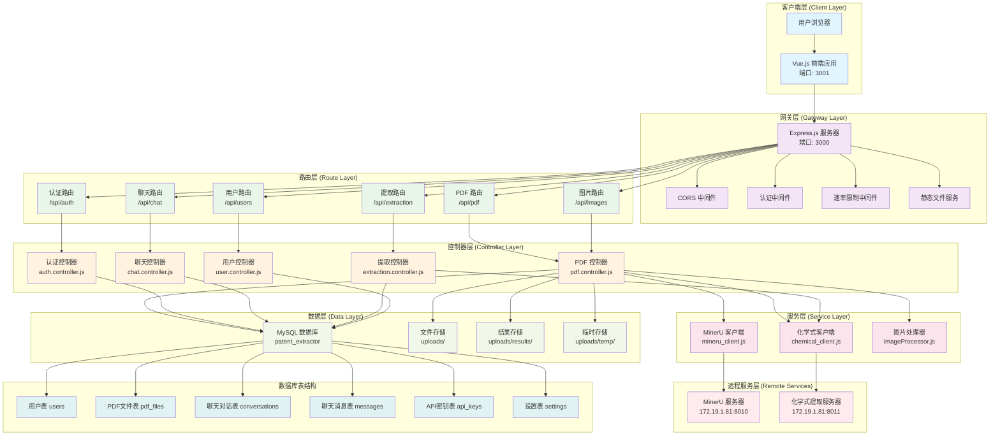
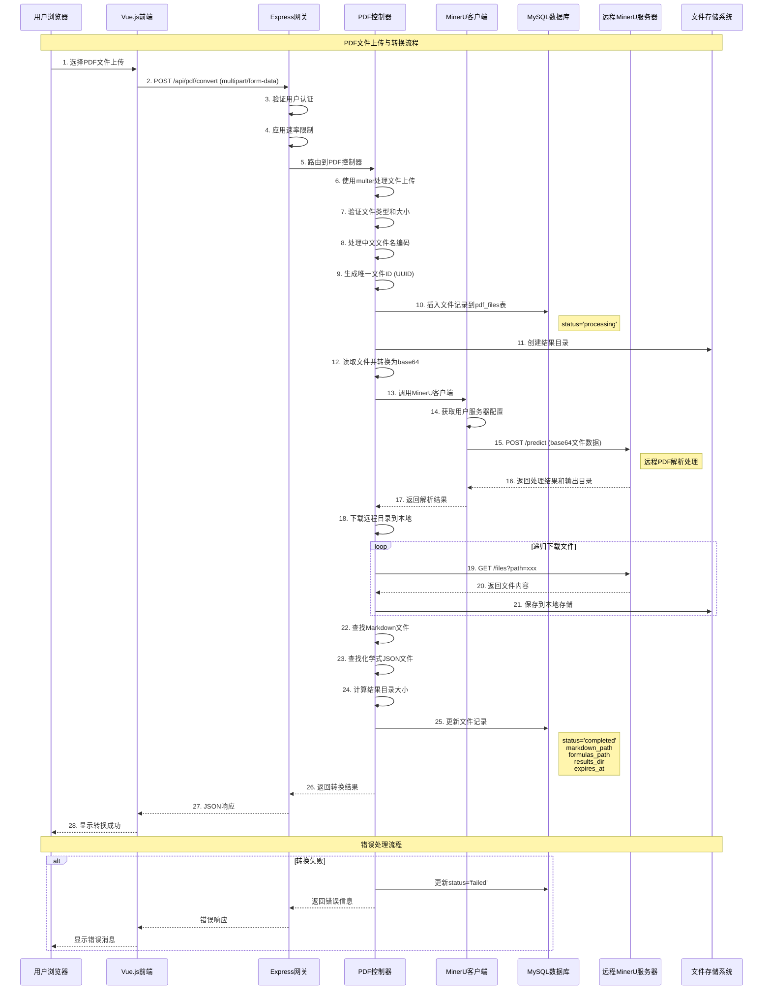

# 化学解析系统后端架构设计

## 1. 系统架构概览

### 1.1 整体架构图



### 1.2 架构层次说明

#### 客户端层 (Client Layer)
- **Vue.js 前端应用** (端口3001)：提供用户界面和交互
- **用户浏览器**：用户访问入口

#### 网关层 (Gateway Layer)
- **Express.js 服务器** (端口3000)：作为API网关，统一处理所有请求
- **中间件系统**：
  - CORS中间件：处理跨域请求
  - 认证中间件：验证用户身份
  - 速率限制中间件：防止API滥用
  - 静态文件服务：提供文件访问

#### 路由层 (Route Layer)
按功能模块划分的路由：
- `/api/pdf`：PDF处理相关
- `/api/auth`：用户认证
- `/api/chat`：AI聊天功能
- `/api/extraction`：化学式提取
- `/api/users`：用户管理
- `/api/images`：图片处理

#### 控制器层 (Controller Layer)
业务逻辑处理：
- **PDF控制器**：处理PDF转换、优化、总结等
- **认证控制器**：处理登录、注册、权限验证
- **聊天控制器**：处理AI对话
- **提取控制器**：处理化学式提取
- **用户控制器**：处理用户信息管理

#### 服务层 (Service Layer)
核心业务服务：
- **MinerU客户端**：与远程PDF解析服务通信
- **化学式客户端**：与化学式提取服务通信
- **图片处理器**：处理图片相关操作

#### 数据层 (Data Layer)
数据存储：
- **MySQL数据库**：存储用户、文件、聊天等结构化数据
- **文件存储系统**：存储上传文件、处理结果、临时文件

#### 远程服务层 (Remote Services)
外部微服务：
- **MinerU服务器** (172.19.1.81:8010)：PDF解析服务
- **化学式提取服务器** (172.19.1.81:8011)：化学式识别服务

## 2. PDF转换业务流程

### 2.1 业务流程图



###  2.2 流程详细说明

#### 文件上传阶段 (步骤1-5)
1. **用户操作**：用户在前端选择PDF文件并上传
2. **请求处理**：前端发送multipart/form-data请求到`/api/pdf/convert`
3. **安全验证**：
   - 验证用户认证token
   - 应用速率限制防止滥用
   - 检查文件类型和大小限制

#### 文件预处理阶段 (步骤6-9)
4. **文件处理**：
   - 使用multer中间件处理文件上传
   - 验证文件类型（支持PDF、DOC、DOCX等）
   - 处理中文文件名编码问题
   - 生成唯一的文件ID (UUID)

#### 数据库记录阶段 (步骤10)
5. **数据库操作**：
   - 在`pdf_files`表中插入文件记录
   - 初始状态设为'processing'
   - 记录用户ID、文件名、文件类型等信息

#### 远程处理阶段 (步骤11-17)
6. **远程服务调用**：
   - 创建本地结果存储目录
   - 将文件转换为base64编码
   - 调用MinerU客户端服务
   - 获取用户配置的服务器URL
   - 发送POST请求到远程MinerU服务器的`/predict`端点

#### 结果下载阶段 (步骤18-21)
7. **结果处理**：
   - 远程服务器返回处理结果和输出目录路径
   - 递归下载远程目录中的所有文件
   - 保持原始目录结构
   - 特殊处理图片文件，确保在images目录中有副本

#### 结果整理阶段 (步骤22-24)
8. **文件整理**：
   - 查找生成的Markdown文件
   - 查找化学式JSON文件
   - 计算结果目录总大小
   - 设置文件过期时间（默认30天）

#### 数据库更新阶段 (步骤25)
9. **状态更新**：
   - 更新数据库中的文件状态为'completed'
   - 记录Markdown文件路径
   - 记录化学式文件路径
   - 记录结果目录路径和大小

#### 响应返回阶段 (步骤26-28)
10. **结果返回**：
    - 构建包含文件URL的响应
    - 返回转换成功的JSON响应
    - 前端显示转换完成状态

## 3. 关键技术实现

### 3.1 文件名编码处理

系统特别处理了中文文件名的编码问题：

```javascript
// 处理中文文件名编码问题
let originalFilename = req.file.originalname;
try {
  if (/[\u0080-\uffff]/.test(originalFilename)) {
    // 尝试UTF-8解码
    const buffer = Buffer.from(originalFilename, 'binary');
    const utf8Name = buffer.toString('utf8');
    if (utf8Name !== originalFilename && /[\u4e00-\u9fa5]/.test(utf8Name)) {
      originalFilename = utf8Name;
    }
  }
  // 移除任何不可打印字符
  originalFilename = originalFilename.replace(/[\u0000-\u001F\u007F-\u009F]/g, '');
} catch (error) {
  console.error('文件名编码转换错误:', error);
}
```

### 3.2 递归目录下载

实现了完整的远程目录下载功能：

```javascript
// 递归下载远程目录的函数
async function downloadRemoteDirectory(remotePath, localPath, originalFilename = null, userId = null, serverBaseUrl = null) {
  // 创建本地目录
  if (!fs.existsSync(localPath)) {
    fs.mkdirSync(localPath, { recursive: true });
  }

  try {
    // 获取远程目录列表
    const response = await axios.get(`${baseUrl}/files/list?path=${encodeURIComponent(remotePath)}`);
    const files = response.data.files;

    // 下载每个文件
    let downloadPromises = [];
    for (const file of files) {
      if (file.isDirectory) {
        // 递归下载子目录
        const subDirPromise = downloadRemoteDirectory(remoteFilePath, localPath, originalFilename);
        downloadPromises.push(subDirPromise);
      } else {
        // 下载文件
        const filePromise = (async () => {
          const fileResponse = await axios.get(`${baseUrl}/files?path=${encodeURIComponent(remoteFilePath)}`);
          fs.writeFileSync(localFilePath, fileResponse.data);
          return true;
        })();
        downloadPromises.push(filePromise);
      }
    }

    // 等待所有下载完成
    const results = await Promise.all(downloadPromises);
    return results.some(result => result === true);
  } catch (error) {
    console.error(`下载目录失败: ${remotePath}, 错误: ${error.message}`);
    return false;
  }
}
```

### 3.3 数据库连接池管理

使用连接池提高数据库访问效率：

```javascript
// 创建数据库连接池
const pool = mysql.createPool({
  host: process.env.DB_HOST || 'localhost',
  user: process.env.DB_USER || 'root',
  password: process.env.DB_PASSWORD || '',
  database: process.env.DB_NAME || 'patent_extractor',
  waitForConnections: true,
  connectionLimit: 10,
  queueLimit: 0
});

// 使用连接池执行查询
async function executeQuery(sql, params) {
  const connection = await pool.getConnection();
  try {
    const [rows] = await connection.execute(sql, params);
    return rows;
  } finally {
    connection.release();
  }
}
```

### 3.4 错误处理机制

完善的错误处理和状态管理：

```javascript
try {
  // 业务逻辑处理
  await processFile();

  // 更新成功状态
  await connection.execute(
    'UPDATE pdf_files SET status = ? WHERE id = ?',
    ['completed', fileId]
  );
} catch (error) {
  // 更新失败状态
  await connection.execute(
    'UPDATE pdf_files SET status = ? WHERE id = ?',
    ['failed', fileId]
  );

  console.error('文件转换错误:', error);
  res.status(500).json({
    success: false,
    message: `文件转换失败: ${error.message}`
  });
}
```

## 4. 数据库设计

### 4.1 核心表结构

#### 用户表 (users)
```sql
CREATE TABLE users (
    id INT AUTO_INCREMENT PRIMARY KEY,
    username VARCHAR(50) NOT NULL UNIQUE,
    email VARCHAR(100) NOT NULL UNIQUE,
    password VARCHAR(255) NOT NULL,
    full_name VARCHAR(100),
    avatar VARCHAR(255),
    role ENUM('admin', 'user') DEFAULT 'user',
    last_login DATETIME,
    created_at TIMESTAMP DEFAULT CURRENT_TIMESTAMP,
    updated_at TIMESTAMP DEFAULT CURRENT_TIMESTAMP ON UPDATE CURRENT_TIMESTAMP
);
```

#### PDF文件表 (pdf_files)
```sql
CREATE TABLE pdf_files (
    id VARCHAR(36) PRIMARY KEY,
    user_id INT NOT NULL,
    original_filename VARCHAR(255) NOT NULL,
    file_type VARCHAR(50) NOT NULL,
    markdown_path VARCHAR(255),
    optimized_markdown_path VARCHAR(255),
    formulas_path VARCHAR(255),
    formulas_count INT DEFAULT 0,
    status VARCHAR(50) DEFAULT 'processing',
    results_dir VARCHAR(255),
    results_size BIGINT DEFAULT 0,
    expires_at TIMESTAMP NULL,
    download_count INT DEFAULT 0,
    last_downloaded_at TIMESTAMP NULL,
    last_accessed_at TIMESTAMP NULL,
    created_at TIMESTAMP DEFAULT CURRENT_TIMESTAMP,
    updated_at TIMESTAMP DEFAULT CURRENT_TIMESTAMP ON UPDATE CURRENT_TIMESTAMP,
    FOREIGN KEY (user_id) REFERENCES users(id) ON DELETE CASCADE
);
```

#### 聊天对话表 (conversations)
```sql
CREATE TABLE conversations (
    id INT AUTO_INCREMENT PRIMARY KEY,
    user_id INT NOT NULL,
    title VARCHAR(255) NOT NULL,
    model VARCHAR(100) NOT NULL,
    created_at TIMESTAMP DEFAULT CURRENT_TIMESTAMP,
    updated_at TIMESTAMP DEFAULT CURRENT_TIMESTAMP ON UPDATE CURRENT_TIMESTAMP,
    FOREIGN KEY (user_id) REFERENCES users(id) ON DELETE CASCADE
);
```

#### 聊天消息表 (messages)
```sql
CREATE TABLE messages (
    id INT AUTO_INCREMENT PRIMARY KEY,
    conversation_id INT NOT NULL,
    role ENUM('user', 'assistant') NOT NULL,
    content TEXT NOT NULL,
    reasoning_content TEXT,
    created_at TIMESTAMP DEFAULT CURRENT_TIMESTAMP,
    FOREIGN KEY (conversation_id) REFERENCES conversations(id) ON DELETE CASCADE
);
```

### 4.2 索引优化

```sql
-- PDF文件表索引
CREATE INDEX idx_pdf_files_user_id_status ON pdf_files(user_id, status);
CREATE INDEX idx_pdf_files_expires_at ON pdf_files(expires_at);
CREATE INDEX idx_pdf_files_created_at ON pdf_files(created_at);

-- 聊天相关索引
CREATE INDEX idx_conversations_user_id ON conversations(user_id);
CREATE INDEX idx_messages_conversation_id ON messages(conversation_id);
CREATE INDEX idx_messages_created_at ON messages(created_at);
```

## 5. 系统优势

1. **分层架构**：清晰的职责分离，便于维护和扩展
2. **微服务设计**：PDF解析和化学式提取作为独立服务
3. **异步处理**：支持大文件的异步转换
4. **错误处理**：完善的错误处理和状态管理
5. **文件管理**：智能的文件存储和过期管理
6. **安全性**：认证、授权、速率限制等安全机制
7. **可扩展性**：模块化设计，易于添加新功能
8. **性能优化**：连接池、缓存、压缩等优化措施

## 6. 部署架构

### 6.1 本地开发环境
- **前端开发服务器**：Vue CLI Dev Server (端口3001)
- **后端API服务器**：Express.js (端口3000)
- **数据库**：MySQL 8.0
- **远程服务**：MinerU服务器 (172.19.1.81:8010)

### 6.2 生产环境建议
- **负载均衡器**：Nginx
- **应用服务器**：PM2 + Express.js
- **数据库**：MySQL 主从复制
- **缓存**：Redis
- **文件存储**：对象存储服务 (OSS/S3)
- **监控**：日志收集和性能监控

这个架构设计体现了现代Web应用的最佳实践，既保证了系统的可扩展性，又确保了业务逻辑的清晰性和可维护性。

---

*文档生成时间：2024年1月*
*系统版本：v2.0*
