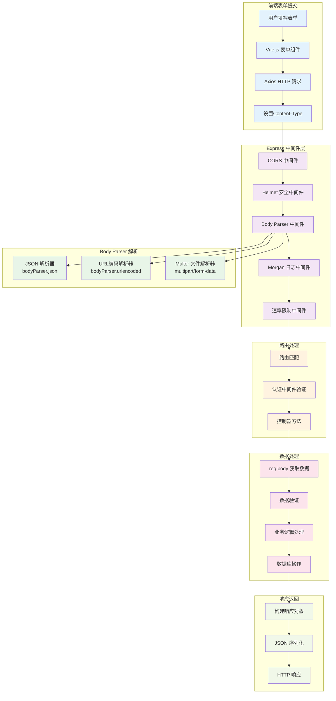
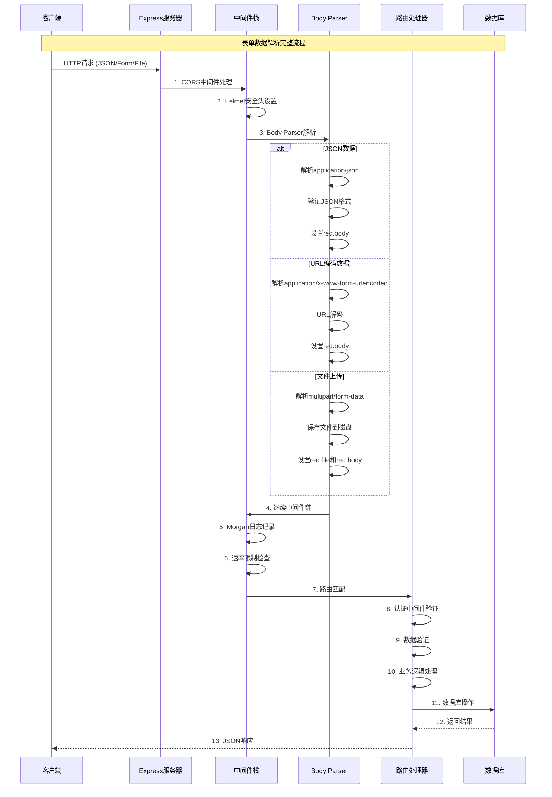

# 化学解析系统表单数据解析机制

## 1. 表单数据解析架构

### 1.1 整体流程图



### 1.2 架构特点

项目采用了**多层次的表单数据解析机制**，支持不同类型的数据格式：

- **JSON数据解析**：用于API调用和AJAX请求
- **URL编码解析**：用于传统HTML表单提交
- **文件上传解析**：用于PDF文件和图片上传
- **安全验证**：多重安全防护机制
- **错误处理**：完善的错误捕获和响应

## 2. 核心解析中间件配置

### 2.1 Body Parser 配置

```javascript
// server/server.js - Body Parser 中间件配置
const bodyParser = require('body-parser');

// JSON数据解析 - 用于API请求
app.use(bodyParser.json({
  limit: '50mb',           // 请求体大小限制
  strict: true,            // 严格模式，只解析数组和对象
  type: 'application/json' // 明确指定MIME类型
}));

// URL编码数据解析 - 用于表单提交
app.use(bodyParser.urlencoded({
  extended: true,          // 支持嵌套对象解析
  limit: '50mb',          // 请求体大小限制
  parameterLimit: 1000    // 参数数量限制
}));
```

### 2.2 中间件执行顺序

```javascript
// 中间件执行顺序（非常重要）
app.use(cors());                    // 1. CORS跨域处理
app.use(helmet());                  // 2. 安全头设置
app.use(compression());             // 3. 响应压缩
app.use(bodyParser.json());         // 4. JSON解析
app.use(bodyParser.urlencoded());   // 5. URL编码解析
app.use(morgan('dev'));             // 6. 请求日志
app.use('/api/', apiLimiter);       // 7. 速率限制
```

## 3. 三种主要数据类型解析

### 3.1 JSON 数据解析 (application/json)

#### 使用场景
- 用户登录/注册
- API调用
- AJAX请求
- Vue.js组件通信

#### 实现示例

```javascript
// 前端发送 JSON 数据
const loginData = {
  username: 'user@example.com',
  password: 'password123'
};

axios.post('/api/auth/login', loginData, {
  headers: {
    'Content-Type': 'application/json'
  }
});

// 后端接收和处理
exports.login = async (req, res) => {
  try {
    // bodyParser.json() 自动解析 JSON 数据到 req.body
    const { username, password } = req.body;

    // 数据验证
    if (!username || !password) {
      return res.status(400).json({
        success: false,
        message: '请提供用户名/邮箱和密码'
      });
    }

    // 判断输入类型（邮箱或用户名）
    const isEmail = username.includes('@');

    // 业务逻辑处理...
    const userModel = new User(req.db);
    let user;

    if (isEmail) {
      user = await userModel.findByEmail(username);
    } else {
      user = await userModel.findByUsername(username);
    }

    if (!user) {
      return res.status(401).json({
        success: false,
        message: isEmail ? '邮箱或密码错误' : '用户名或密码错误'
      });
    }

    // 密码验证
    const isPasswordValid = await userModel.verifyPassword(password, user.password);
    if (!isPasswordValid) {
      return res.status(401).json({
        success: false,
        message: isEmail ? '邮箱或密码错误' : '用户名或密码错误'
      });
    }

    // 创建会话
    const session = await userModel.createSession(
      user.id,
      req.ip,
      req.headers['user-agent']
    );

    // 返回成功响应
    res.status(200).json({
      success: true,
      message: '登录成功',
      data: {
        user: {
          id: user.id,
          username: user.username,
          email: user.email,
          fullName: user.full_name,
          role: user.role
        },
        token: session.token,
        expiresAt: session.expiresAt
      }
    });
  } catch (error) {
    console.error('登录错误:', error);
    res.status(500).json({
      success: false,
      message: '登录过程中发生错误',
      error: error.message
    });
  }
};
```

#### JSON解析特点

| 特点 | 说明 | 优势 |
|------|------|------|
| **结构化** | 支持嵌套对象和数组 | 数据组织清晰 |
| **类型保持** | 保持数据类型（数字、布尔值等） | 无需类型转换 |
| **标准化** | 遵循JSON标准 | 跨平台兼容 |
| **轻量级** | 相比XML更轻量 | 传输效率高 |

### 3.2 URL编码数据解析 (application/x-www-form-urlencoded)

#### 使用场景
- 传统HTML表单提交
- 简单的键值对数据
- 兼容性要求高的场景

#### 数据格式示例

```
// 原始表单数据
username=user%40example.com&password=password123&fullName=John%20Doe&remember=true

// 解析后的 req.body
{
  username: 'user@example.com',
  password: 'password123',
  fullName: 'John Doe',
  remember: 'true'  // 注意：所有值都是字符串
}
```

#### 配置详解

```javascript
app.use(bodyParser.urlencoded({
  extended: true,          // 支持嵌套对象解析
  limit: '50mb',          // 请求体大小限制
  parameterLimit: 1000    // 参数数量限制
}));

// extended: true 支持的嵌套结构
// user[name]=John&user[email]=john@example.com
// 解析为: { user: { name: 'John', email: 'john@example.com' } }

// extended: false 只支持简单键值对
// user[name]=John&user[email]=john@example.com
// 解析为: { 'user[name]': 'John', 'user[email]': 'john@example.com' }
```

### 3.3 文件上传数据解析 (multipart/form-data)

#### 使用场景
- PDF文件上传
- 图片上传
- 混合数据提交（文件+表单数据）

#### Multer 配置

```javascript
// server/controllers/pdf.controller.js - Multer 文件上传配置
const multer = require('multer');
const path = require('path');
const fs = require('fs');

// 存储配置
const storage = multer.diskStorage({
  destination: function (req, file, cb) {
    const uploadDir = path.join(__dirname, '../../uploads/pdf');
    // 确保目录存在
    if (!fs.existsSync(uploadDir)) {
      fs.mkdirSync(uploadDir, { recursive: true });
    }
    cb(null, uploadDir);
  },
  filename: function (req, file, cb) {
    // 生成唯一文件名
    const uniqueSuffix = Date.now() + '-' + Math.round(Math.random() * 1E9);
    const ext = path.extname(file.originalname);
    cb(null, uniqueSuffix + ext);
  }
});

// Multer 实例配置
const upload = multer({
  storage: storage,
  limits: {
    fileSize: 50 * 1024 * 1024,  // 文件大小限制：50MB
    files: 1,                     // 文件数量限制：1个
    fields: 10                    // 表单字段数量限制：10个
  },
  fileFilter: function (req, file, cb) {
    // 文件类型验证
    const allowedTypes = [
      'application/pdf',
      'application/msword',
      'application/vnd.openxmlformats-officedocument.wordprocessingml.document',
      'application/vnd.ms-powerpoint',
      'application/vnd.openxmlformats-officedocument.presentationml.presentation',
      'image/jpeg',
      'image/png'
    ];

    if (allowedTypes.includes(file.mimetype)) {
      cb(null, true);
    } else {
      cb(new Error('不支持的文件类型。支持的类型: PDF, DOC, DOCX, PPT, PPTX, JPG, PNG'));
    }
  }
}).single('file'); // 单文件上传，字段名为 'file'
```

#### 文件上传处理

```javascript
// PDF转换控制器
exports.convertPDF = async (req, res) => {
  // 使用 multer 中间件处理文件上传
  upload(req, res, async (err) => {
    if (err) {
      // 处理上传错误
      if (err.code === 'LIMIT_FILE_SIZE') {
        return res.status(400).json({
          success: false,
          message: '文件大小超过限制 (50MB)'
        });
      }

      return res.status(400).json({
        success: false,
        message: err.message
      });
    }

    // 检查是否有文件上传
    if (!req.file) {
      return res.status(400).json({
        success: false,
        message: '请选择要上传的文件'
      });
    }

    // 文件信息在 req.file 中
    const file = req.file;
    // 其他表单数据在 req.body 中
    const { description } = req.body;

    // 处理中文文件名编码问题
    let originalFilename = file.originalname;
    try {
      if (/[\u0080-\uffff]/.test(originalFilename)) {
        // 尝试UTF-8解码
        const buffer = Buffer.from(originalFilename, 'binary');
        const utf8Name = buffer.toString('utf8');
        if (utf8Name !== originalFilename && /[\u4e00-\u9fa5]/.test(utf8Name)) {
          originalFilename = utf8Name;
        }
      }

      // 移除不可打印字符
      originalFilename = originalFilename.replace(/[\u0000-\u001F\u007F-\u009F]/g, '');

      // 确保文件名有效
      if (!originalFilename || originalFilename.trim() === '') {
        originalFilename = '未命名文件';
      }
    } catch (error) {
      console.error('文件名编码转换错误:', error);
    }

    // 生成文件ID
    const fileId = uuidv4();
    const userId = req.user && req.user.id ? req.user.id : 1;

    try {
      // 保存文件记录到数据库
      const connection = await pool.getConnection();
      await connection.execute(
        'INSERT INTO pdf_files (id, user_id, original_filename, file_type, status) VALUES (?, ?, ?, ?, ?)',
        [fileId, userId, originalFilename, file.mimetype, 'processing']
      );
      connection.release();

      // 异步处理文件转换
      processFileAsync(fileId, file.path, originalFilename, userId);

      // 立即返回响应
      res.status(200).json({
        success: true,
        message: '文件上传成功，正在处理中...',
        data: {
          fileId: fileId,
          originalFilename: originalFilename,
          status: 'processing'
        }
      });

    } catch (error) {
      console.error('文件处理错误:', error);
      res.status(500).json({
        success: false,
        message: '文件处理失败',
        error: error.message
      });
    }
  });
};
```

#### 前端文件上传

```javascript
// Vue.js 前端文件上传
const uploadFile = async (file) => {
  const formData = new FormData();
  formData.append('file', file);
  formData.append('description', '文件描述');

  try {
    const response = await axios.post('/api/pdf/convert', formData, {
      headers: {
        'Content-Type': 'multipart/form-data'
      },
      onUploadProgress: (progressEvent) => {
        const percentCompleted = Math.round(
          (progressEvent.loaded * 100) / progressEvent.total
        );
        console.log(`上传进度: ${percentCompleted}%`);
      }
    });

    console.log('上传成功:', response.data);
  } catch (error) {
    console.error('上传失败:', error.response?.data?.message);
  }
};
```

## 4. 数据解析时序图

### 4.1 完整请求处理流程



## 5. 数据验证和安全处理

### 5.1 输入验证机制

```javascript
// 通用验证函数
function validateInput(data, rules) {
  const errors = [];

  for (const [field, rule] of Object.entries(rules)) {
    const value = data[field];

    // 必填验证
    if (rule.required && (!value || value.trim() === '')) {
      errors.push(`${field} 是必填字段`);
    }

    // 类型验证
    if (value && rule.type) {
      switch (rule.type) {
        case 'email':
          if (!/\S+@\S+\.\S+/.test(value)) {
            errors.push(`${field} 邮箱格式不正确`);
          }
          break;
        case 'string':
          if (typeof value !== 'string') {
            errors.push(`${field} 必须是字符串`);
          }
          break;
        case 'number':
          if (isNaN(Number(value))) {
            errors.push(`${field} 必须是数字`);
          }
          break;
      }
    }

    // 长度验证
    if (value && rule.minLength && value.length < rule.minLength) {
      errors.push(`${field} 长度不能少于 ${rule.minLength} 个字符`);
    }

    if (value && rule.maxLength && value.length > rule.maxLength) {
      errors.push(`${field} 长度不能超过 ${rule.maxLength} 个字符`);
    }

    // 正则表达式验证
    if (value && rule.pattern && !rule.pattern.test(value)) {
      errors.push(`${field} 格式不符合要求`);
    }
  }

  return errors;
}

// 使用示例 - 用户注册验证
exports.register = async (req, res) => {
  const validationRules = {
    username: {
      required: true,
      type: 'string',
      minLength: 3,
      maxLength: 50,
      pattern: /^[a-zA-Z0-9_]+$/ // 只允许字母、数字、下划线
    },
    email: {
      required: true,
      type: 'email',
      maxLength: 100
    },
    password: {
      required: true,
      type: 'string',
      minLength: 6,
      maxLength: 128
    },
    verificationCode: {
      required: true,
      type: 'string',
      pattern: /^\d{6}$/ // 6位数字
    }
  };

  const errors = validateInput(req.body, validationRules);
  if (errors.length > 0) {
    return res.status(400).json({
      success: false,
      message: '输入验证失败',
      errors: errors
    });
  }

  // 继续处理注册逻辑...
};
```

### 5.2 安全防护机制

#### XSS 防护

```javascript
// XSS 防护 - 清理HTML标签和特殊字符
function sanitizeInput(input) {
  if (typeof input !== 'string') return input;

  return input
    .replace(/</g, '&lt;')      // 转义小于号
    .replace(/>/g, '&gt;')      // 转义大于号
    .replace(/"/g, '&quot;')    // 转义双引号
    .replace(/'/g, '&#x27;')    // 转义单引号
    .replace(/\//g, '&#x2F;')   // 转义斜杠
    .trim();                    // 去除首尾空格
}

// 递归清理对象中的所有字符串
function sanitizeObject(obj) {
  if (typeof obj === 'string') {
    return sanitizeInput(obj);
  } else if (Array.isArray(obj)) {
    return obj.map(sanitizeObject);
  } else if (obj && typeof obj === 'object') {
    const sanitized = {};
    for (const [key, value] of Object.entries(obj)) {
      sanitized[key] = sanitizeObject(value);
    }
    return sanitized;
  }
  return obj;
}

// 中间件：自动清理请求数据
const sanitizeMiddleware = (req, res, next) => {
  if (req.body) {
    req.body = sanitizeObject(req.body);
  }
  if (req.query) {
    req.query = sanitizeObject(req.query);
  }
  if (req.params) {
    req.params = sanitizeObject(req.params);
  }
  next();
};

// 应用到特定路由
app.use('/api/auth', sanitizeMiddleware);
```

#### SQL注入防护

```javascript
// ✅ 安全的参数化查询
async function createUser(userData) {
  const connection = await pool.getConnection();
  try {
    // 使用参数化查询防止SQL注入
    const [result] = await connection.execute(
      'INSERT INTO users (username, email, password, full_name) VALUES (?, ?, ?, ?)',
      [userData.username, userData.email, userData.hashedPassword, userData.fullName]
    );
    return { id: result.insertId, ...userData };
  } finally {
    connection.release();
  }
}

// ❌ 危险的字符串拼接（容易SQL注入）
// const query = `INSERT INTO users (username, email) VALUES ('${userData.username}', '${userData.email}')`;
// 如果 userData.username = "admin'; DROP TABLE users; --"
// 将导致SQL注入攻击

// 查询条件构建器（安全版本）
class QueryBuilder {
  constructor() {
    this.query = '';
    this.params = [];
  }

  select(fields) {
    this.query += `SELECT ${fields} `;
    return this;
  }

  from(table) {
    this.query += `FROM ${table} `;
    return this;
  }

  where(condition, value) {
    this.query += `WHERE ${condition} `;
    this.params.push(value);
    return this;
  }

  and(condition, value) {
    this.query += `AND ${condition} `;
    this.params.push(value);
    return this;
  }

  build() {
    return { query: this.query, params: this.params };
  }
}

// 使用示例
const { query, params } = new QueryBuilder()
  .select('*')
  .from('users')
  .where('username = ?', username)
  .and('status = ?', 'active')
  .build();

const [rows] = await connection.execute(query, params);
```

#### 文件上传安全

```javascript
// 文件类型验证（MIME类型 + 文件扩展名双重验证）
const validateFileType = (file) => {
  const allowedMimeTypes = [
    'application/pdf',
    'application/msword',
    'application/vnd.openxmlformats-officedocument.wordprocessingml.document',
    'image/jpeg',
    'image/png'
  ];

  const allowedExtensions = ['.pdf', '.doc', '.docx', '.jpg', '.jpeg', '.png'];

  // 验证MIME类型
  if (!allowedMimeTypes.includes(file.mimetype)) {
    return { valid: false, message: '不支持的文件类型' };
  }

  // 验证文件扩展名
  const ext = path.extname(file.originalname).toLowerCase();
  if (!allowedExtensions.includes(ext)) {
    return { valid: false, message: '不支持的文件扩展名' };
  }

  return { valid: true };
};

// 文件内容验证（检查文件头）
const validateFileContent = (filePath) => {
  const buffer = fs.readFileSync(filePath);
  const fileSignatures = {
    pdf: [0x25, 0x50, 0x44, 0x46],           // %PDF
    jpeg: [0xFF, 0xD8, 0xFF],                // JPEG
    png: [0x89, 0x50, 0x4E, 0x47],           // PNG
    doc: [0xD0, 0xCF, 0x11, 0xE0],           // DOC
    docx: [0x50, 0x4B, 0x03, 0x04]           // DOCX (ZIP)
  };

  for (const [type, signature] of Object.entries(fileSignatures)) {
    if (signature.every((byte, index) => buffer[index] === byte)) {
      return { valid: true, type };
    }
  }

  return { valid: false, message: '文件内容与扩展名不匹配' };
};

// 安全的文件名处理
const sanitizeFilename = (filename) => {
  return filename
    .replace(/[^a-zA-Z0-9\u4e00-\u9fa5._-]/g, '_') // 只保留安全字符
    .replace(/\.{2,}/g, '.')                        // 防止目录遍历
    .replace(/^\.+/, '')                            // 移除开头的点
    .substring(0, 255);                             // 限制长度
};
```

## 6. 错误处理机制

### 6.1 全局错误处理中间件

```javascript
// server/server.js - 全局错误处理中间件
app.use((err, req, res, next) => {
  console.error('错误详情:', {
    message: err.message,
    stack: err.stack,
    url: req.url,
    method: req.method,
    ip: req.ip,
    userAgent: req.get('User-Agent'),
    timestamp: new Date().toISOString()
  });

  // Body Parser 相关错误
  if (err.type === 'entity.parse.failed') {
    return res.status(400).json({
      success: false,
      message: 'JSON 格式错误',
      error: 'INVALID_JSON'
    });
  }

  if (err.type === 'entity.too.large') {
    return res.status(413).json({
      success: false,
      message: '请求体过大',
      error: 'PAYLOAD_TOO_LARGE'
    });
  }

  // Multer 文件上传错误
  if (err.code === 'LIMIT_FILE_SIZE') {
    return res.status(400).json({
      success: false,
      message: '文件大小超过限制 (50MB)',
      error: 'FILE_TOO_LARGE'
    });
  }

  if (err.code === 'LIMIT_FILE_COUNT') {
    return res.status(400).json({
      success: false,
      message: '文件数量超过限制',
      error: 'TOO_MANY_FILES'
    });
  }

  if (err.code === 'LIMIT_UNEXPECTED_FILE') {
    return res.status(400).json({
      success: false,
      message: '意外的文件字段',
      error: 'UNEXPECTED_FILE'
    });
  }

  // 文件类型错误
  if (err.message && err.message.includes('不支持的文件类型')) {
    return res.status(400).json({
      success: false,
      message: err.message,
      error: 'UNSUPPORTED_FILE_TYPE'
    });
  }

  // 数据库错误
  if (err.code === 'ER_DUP_ENTRY') {
    return res.status(409).json({
      success: false,
      message: '数据已存在',
      error: 'DUPLICATE_ENTRY'
    });
  }

  if (err.code === 'ER_NO_SUCH_TABLE') {
    return res.status(500).json({
      success: false,
      message: '数据库表不存在',
      error: 'TABLE_NOT_FOUND'
    });
  }

  // 认证错误
  if (err.name === 'UnauthorizedError') {
    return res.status(401).json({
      success: false,
      message: '认证失败',
      error: 'UNAUTHORIZED'
    });
  }

  // 默认错误响应
  res.status(err.status || 500).json({
    success: false,
    message: err.message || '服务器内部错误',
    error: process.env.NODE_ENV === 'development' ? {
      stack: err.stack,
      details: err
    } : 'INTERNAL_SERVER_ERROR'
  });
});
```

### 6.2 特定错误处理

```javascript
// 异步错误处理包装器
const asyncHandler = (fn) => (req, res, next) => {
  Promise.resolve(fn(req, res, next)).catch(next);
};

// 使用示例
exports.register = asyncHandler(async (req, res) => {
  const { username, email, password, verificationCode } = req.body;

  // 验证验证码
  const userModel = new User(req.db);
  const isCodeValid = await userModel.verifyCode(email, verificationCode);

  if (!isCodeValid) {
    const error = new Error('验证码无效或已过期');
    error.status = 400;
    error.code = 'INVALID_VERIFICATION_CODE';
    throw error;
  }

  // 检查用户名是否已存在
  const existingUsername = await userModel.findByUsername(username);
  if (existingUsername) {
    const error = new Error('用户名已被使用');
    error.status = 409;
    error.code = 'USERNAME_EXISTS';
    throw error;
  }

  // 继续处理...
});

// 自定义错误类
class ValidationError extends Error {
  constructor(message, field) {
    super(message);
    this.name = 'ValidationError';
    this.status = 400;
    this.field = field;
  }
}

class AuthenticationError extends Error {
  constructor(message) {
    super(message);
    this.name = 'AuthenticationError';
    this.status = 401;
  }
}

class AuthorizationError extends Error {
  constructor(message) {
    super(message);
    this.name = 'AuthorizationError';
    this.status = 403;
  }
}

// 使用自定义错误
if (!username) {
  throw new ValidationError('用户名是必填字段', 'username');
}

if (!isPasswordValid) {
  throw new AuthenticationError('密码错误');
}

if (user.role !== 'admin') {
  throw new AuthorizationError('需要管理员权限');
}
```

## 7. 性能优化配置

### 7.1 Body Parser 性能优化

```javascript
// 针对不同路由使用不同的解析器
app.use('/api/auth', bodyParser.json({ limit: '1mb' }));     // 认证接口较小
app.use('/api/upload', bodyParser.json({ limit: '50mb' }));  // 上传接口较大

// 条件性解析 - 只在需要时解析
const conditionalParser = (req, res, next) => {
  if (req.headers['content-type']?.includes('application/json')) {
    bodyParser.json({ limit: '10mb' })(req, res, next);
  } else {
    next();
  }
};

// 压缩中间件配置
app.use(compression({
  filter: (req, res) => {
    // 不压缩文件上传响应
    if (req.headers['content-type']?.includes('multipart/form-data')) {
      return false;
    }
    return compression.filter(req, res);
  },
  level: 6,        // 压缩级别 (1-9)
  threshold: 1024  // 只压缩大于1KB的响应
}));
```

### 7.2 Multer 性能优化

```javascript
// 内存存储 vs 磁盘存储
const memoryStorage = multer.memoryStorage(); // 小文件用内存存储
const diskStorage = multer.diskStorage({      // 大文件用磁盘存储
  destination: './uploads/',
  filename: (req, file, cb) => {
    cb(null, `${Date.now()}-${file.originalname}`);
  }
});

// 根据文件大小选择存储方式
const adaptiveUpload = multer({
  storage: (req, file, cb) => {
    const contentLength = parseInt(req.headers['content-length']);
    if (contentLength < 5 * 1024 * 1024) { // 5MB以下用内存
      cb(null, memoryStorage);
    } else {
      cb(null, diskStorage);
    }
  },
  limits: {
    fileSize: 50 * 1024 * 1024,
    files: 5,
    fields: 20
  }
});

// 流式处理大文件
const streamUpload = (req, res) => {
  const busboy = new Busboy({ headers: req.headers });

  busboy.on('file', (fieldname, file, filename, encoding, mimetype) => {
    const saveTo = path.join('./uploads/', filename);
    const writeStream = fs.createWriteStream(saveTo);

    file.pipe(writeStream);

    file.on('end', () => {
      console.log(`文件 ${filename} 上传完成`);
    });
  });

  req.pipe(busboy);
};
```

## 8. 监控和日志

### 8.1 请求日志配置

```javascript
// Morgan 日志配置
const morgan = require('morgan');

// 自定义日志格式
morgan.token('body', (req) => {
  // 不记录敏感信息
  const sensitiveFields = ['password', 'token', 'verificationCode'];
  const body = { ...req.body };

  sensitiveFields.forEach(field => {
    if (body[field]) {
      body[field] = '***';
    }
  });

  return JSON.stringify(body);
});

// 开发环境日志
if (process.env.NODE_ENV === 'development') {
  app.use(morgan(':method :url :status :res[content-length] - :response-time ms :body'));
}

// 生产环境日志
if (process.env.NODE_ENV === 'production') {
  app.use(morgan('combined', {
    stream: fs.createWriteStream(path.join(__dirname, 'access.log'), { flags: 'a' })
  }));
}
```

### 8.2 性能监控

```javascript
// 请求处理时间监控
const performanceMiddleware = (req, res, next) => {
  const start = Date.now();

  res.on('finish', () => {
    const duration = Date.now() - start;

    // 记录慢请求
    if (duration > 1000) {
      console.warn(`慢请求警告: ${req.method} ${req.url} - ${duration}ms`);
    }

    // 记录到监控系统
    if (process.env.MONITORING_ENABLED === 'true') {
      recordMetric('request_duration', duration, {
        method: req.method,
        route: req.route?.path,
        status: res.statusCode
      });
    }
  });

  next();
};

app.use(performanceMiddleware);
```

## 9. 系统优势总结

### 9.1 技术优势

| 优势 | 说明 | 实现方式 |
|------|------|----------|
| **多格式支持** | 支持JSON、URL编码、文件上传 | Body Parser + Multer |
| **安全防护** | XSS、SQL注入、文件类型验证 | 输入清理 + 参数化查询 |
| **性能优化** | 合理的大小限制、压缩 | 配置优化 + 流式处理 |
| **错误处理** | 完善的错误捕获和响应 | 全局错误中间件 |
| **编码处理** | 中文文件名编码问题 | 多重编码检测 |
| **监控日志** | 详细的请求和性能日志 | Morgan + 自定义监控 |

### 9.2 架构特点

- **分层设计**：清晰的中间件层次结构
- **模块化**：各种解析器独立配置
- **可扩展**：易于添加新的数据格式支持
- **健壮性**：完善的错误处理和恢复机制
- **安全性**：多重安全防护措施

### 9.3 适用场景

- ✅ **企业级应用**：完善的安全和监控机制
- ✅ **文件处理系统**：专业的文件上传处理
- ✅ **API服务**：标准化的数据解析
- ✅ **多端应用**：支持不同客户端的数据格式

这个表单数据解析机制为项目提供了企业级的数据处理能力，既保证了功能的完整性，又确保了系统的安全性和性能！

---

*文档生成时间：2024年1月*
*系统版本：v2.0*
