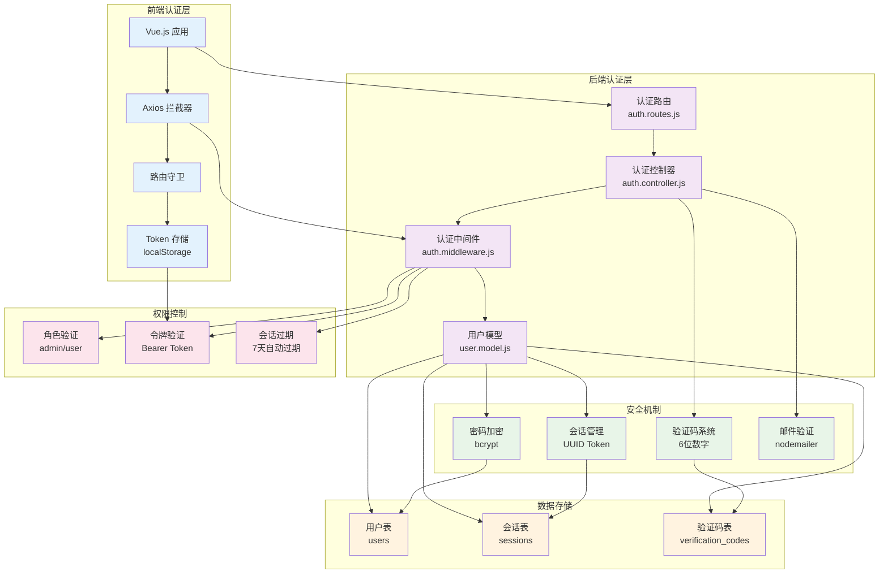
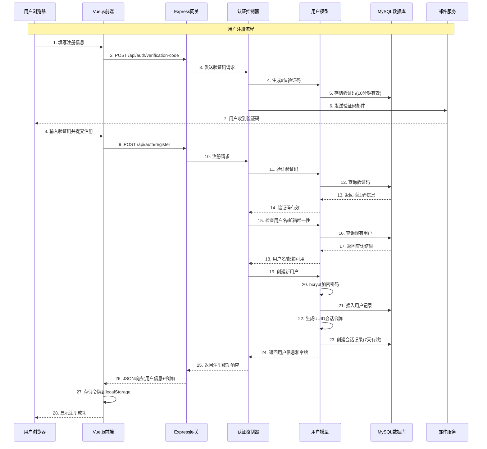
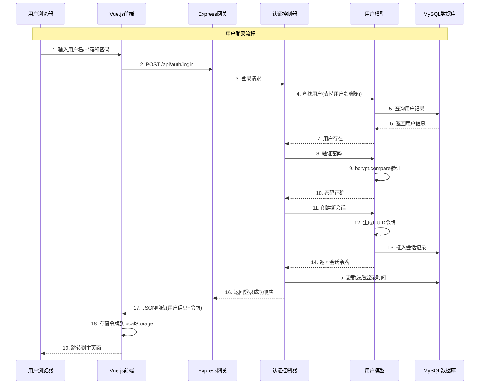
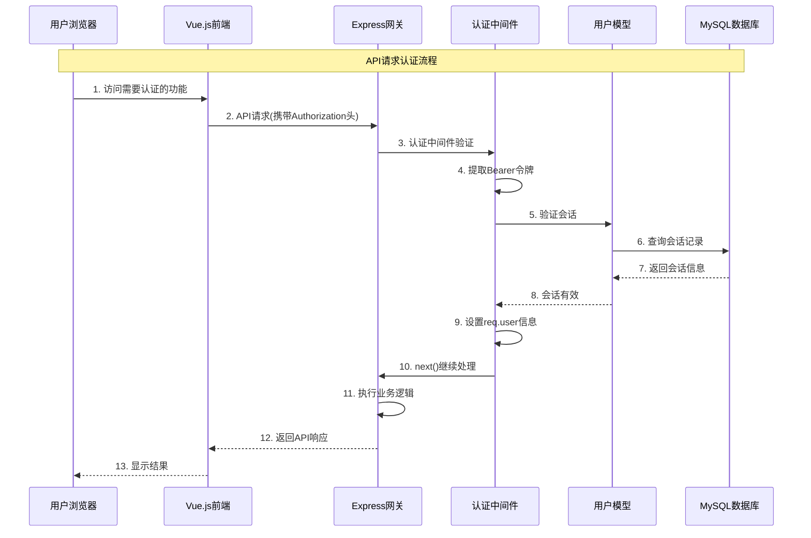

# 化学解析系统认证机制详解

## 1. 认证系统架构

### 1.1 整体架构图



### 1.2 认证机制特点

项目采用了**基于会话令牌的认证机制**，具有以下特点：

- **多重验证**：邮箱验证码 + 密码验证
- **安全存储**：bcrypt密码加密，UUID会话令牌
- **灵活登录**：支持用户名或邮箱登录
- **自动过期**：7天会话过期，10分钟验证码过期
- **审计追踪**：记录IP地址、设备信息、登录时间

## 2. 核心组件详解

### 2.1 认证中间件 (auth.middleware.js)

```javascript
exports.verifyToken = async (req, res, next) => {
  try {
    let token;

    // 从请求头中获取令牌
    const authHeader = req.headers.authorization;
    if (authHeader && authHeader.startsWith('Bearer ')) {
      token = authHeader.split(' ')[1];
    }

    // 如果请求头中没有令牌，尝试从请求体中获取
    if (!token && req.body && req.body.token) {
      token = req.body.token;
    }

    if (!token) {
      return res.status(401).json({
        success: false,
        message: '访问令牌缺失'
      });
    }

    // 验证令牌
    const userModel = new User(req.db);
    const session = await userModel.verifySession(token);

    if (!session) {
      return res.status(401).json({
        success: false,
        message: '令牌无效或已过期'
      });
    }

    // 将用户信息添加到请求对象
    req.user = {
      id: session.user_id,
      username: session.username,
      email: session.email,
      role: session.role
    };

    next();
  } catch (error) {
    console.error('令牌验证错误:', error);
    res.status(500).json({
      success: false,
      message: '服务器内部错误'
    });
  }
};
```

**功能特点：**
- 支持多种令牌传递方式（Authorization头、请求体）
- 自动验证会话有效性和过期时间
- 将用户信息注入到请求对象中
- 完善的错误处理机制

### 2.2 密码安全机制

```javascript
// 创建新用户时加密密码
async create(userData) {
  // 加密密码
  const salt = await bcrypt.genSalt(10);
  const hashedPassword = await bcrypt.hash(userData.password, salt);

  const [result] = await this.db.execute(
    'INSERT INTO users (username, email, password, full_name) VALUES (?, ?, ?, ?)',
    [userData.username, userData.email, hashedPassword, userData.fullName || null]
  );

  return { id: result.insertId, ...userData, password: undefined };
}

// 验证用户密码
async verifyPassword(plainPassword, hashedPassword) {
  return await bcrypt.compare(plainPassword, hashedPassword);
}
```

**安全特性：**
- 使用bcrypt进行密码哈希
- Salt轮数为10（安全性与性能平衡）
- 密码明文永不存储
- 返回数据时自动排除密码字段

### 2.3 会话管理机制

```javascript
// 创建会话
async createSession(userId, ipAddress, userAgent) {
  const token = uuidv4();
  const expiresAt = new Date();
  expiresAt.setDate(expiresAt.getDate() + 7); // 7天后过期

  await this.db.execute(
    'INSERT INTO sessions (user_id, token, ip_address, user_agent, expires_at) VALUES (?, ?, ?, ?, ?)',
    [userId, token, ipAddress, userAgent, expiresAt]
  );

  return { token, expiresAt };
}

// 验证会话
async verifySession(token) {
  const [rows] = await this.db.execute(
    'SELECT s.*, u.id as user_id, u.username, u.email, u.role FROM sessions s JOIN users u ON s.user_id = u.id WHERE s.token = ? AND s.expires_at > NOW()',
    [token]
  );
  return rows[0] || null;
}
```

**会话特性：**
- 使用UUID生成唯一令牌
- 7天自动过期机制
- 记录IP地址和User-Agent（安全审计）
- 数据库级别的过期时间验证

### 2.4 邮箱验证码系统

```javascript
// 生成验证码
async generateVerificationCode(email) {
  // 生成6位随机数字验证码
  const code = Math.floor(100000 + Math.random() * 900000).toString();

  // 设置过期时间为10分钟后
  const expiresAt = new Date();
  expiresAt.setMinutes(expiresAt.getMinutes() + 10);

  // 删除该邮箱之前的验证码
  await this.db.execute('DELETE FROM verification_codes WHERE email = ?', [email]);

  // 插入新验证码
  await this.db.execute(
    'INSERT INTO verification_codes (email, code, expires_at) VALUES (?, ?, ?)',
    [email, code, expiresAt]
  );

  return code;
}

// 验证验证码
async verifyCode(email, code) {
  const [rows] = await this.db.execute(
    'SELECT * FROM verification_codes WHERE email = ? AND code = ? AND expires_at > NOW()',
    [email, code]
  );

  if (rows.length > 0) {
    // 验证成功后删除验证码
    await this.db.execute('DELETE FROM verification_codes WHERE email = ?', [email]);
    return true;
  }

  return false;
}
```

**验证码特性：**
- 6位数字验证码
- 10分钟有效期
- 一个邮箱同时只能有一个有效验证码
- 使用后自动删除

## 3. 认证流程详解

### 3.1 用户注册流程图



### 3.2 用户登录流程图



### 3.3 API请求认证流程图



## 4. 数据库设计

### 4.1 用户表 (users)

```sql
CREATE TABLE users (
    id INT AUTO_INCREMENT PRIMARY KEY,
    username VARCHAR(50) NOT NULL UNIQUE,
    email VARCHAR(100) NOT NULL UNIQUE,
    password VARCHAR(255) NOT NULL,  -- bcrypt哈希
    full_name VARCHAR(100),
    avatar VARCHAR(255),
    role ENUM('admin', 'user') DEFAULT 'user',
    last_login DATETIME,
    created_at TIMESTAMP DEFAULT CURRENT_TIMESTAMP,
    updated_at TIMESTAMP DEFAULT CURRENT_TIMESTAMP ON UPDATE CURRENT_TIMESTAMP,

    INDEX idx_username (username),
    INDEX idx_email (email)
);
```

### 4.2 会话表 (sessions)

```sql
CREATE TABLE sessions (
    id INT AUTO_INCREMENT PRIMARY KEY,
    user_id INT NOT NULL,
    token VARCHAR(255) NOT NULL UNIQUE,  -- UUID令牌
    ip_address VARCHAR(45),              -- 支持IPv6
    user_agent TEXT,
    expires_at TIMESTAMP NOT NULL,       -- 过期时间
    created_at TIMESTAMP DEFAULT CURRENT_TIMESTAMP,

    FOREIGN KEY (user_id) REFERENCES users(id) ON DELETE CASCADE,
    INDEX idx_token (token),
    INDEX idx_user_expires (user_id, expires_at)
);
```

### 4.3 验证码表 (verification_codes)

```sql
CREATE TABLE verification_codes (
    id INT AUTO_INCREMENT PRIMARY KEY,
    email VARCHAR(100) NOT NULL,
    code VARCHAR(10) NOT NULL,          -- 6位数字验证码
    expires_at TIMESTAMP NOT NULL,      -- 10分钟过期
    created_at TIMESTAMP DEFAULT CURRENT_TIMESTAMP,

    INDEX idx_email_code (email, code),
    INDEX idx_expires (expires_at)
);
```

## 5. 路由保护策略

### 5.1 公开路由（无需认证）

```javascript
// 不需要认证的路由
router.post('/register', authController.register);
router.post('/login', authController.login);
router.post('/verification-code', authController.sendVerificationCode);
router.get('/verify-token', authController.verifyToken);
```

### 5.2 受保护路由（需要认证）

```javascript
// 需要认证的路由
router.post('/logout', authMiddleware.verifyToken, authController.logout);
router.get('/me', authMiddleware.verifyToken, authController.getCurrentUser);

// 其他业务路由也使用认证中间件
app.use('/api/pdf', authMiddleware.verifyToken, pdfRoutes);
app.use('/api/chat', authMiddleware.verifyToken, chatRoutes);
app.use('/api/users', authMiddleware.verifyToken, userRoutes);
```

### 5.3 管理员路由（需要管理员权限）

```javascript
// 管理员权限验证中间件
exports.verifyAdmin = (req, res, next) => {
  if (!req.user || req.user.role !== 'admin') {
    return res.status(403).json({
      success: false,
      message: '需要管理员权限'
    });
  }
  next();
};

// 使用示例
router.get('/admin/users', authMiddleware.verifyToken, authMiddleware.verifyAdmin, adminController.getAllUsers);
```

## 6. 安全特性

### 6.1 多层安全防护

#### 传输层安全
- **HTTPS加密**：所有认证相关请求使用HTTPS传输
- **CORS配置**：严格的跨域资源共享策略
- **请求头验证**：验证请求来源和格式

#### 存储层安全
- **密码加密**：使用bcrypt进行不可逆哈希
- **令牌安全**：UUID随机生成，无法预测
- **数据库安全**：参数化查询防止SQL注入

#### 会话层安全
- **自动过期**：7天会话自动失效
- **设备绑定**：记录IP和User-Agent
- **单点登录**：可选择是否允许多设备同时登录

### 6.2 攻击防护机制

#### 暴力破解防护
```javascript
// 登录失败次数限制
const loginAttempts = new Map();

exports.checkLoginAttempts = (req, res, next) => {
  const ip = req.ip;
  const attempts = loginAttempts.get(ip) || 0;

  if (attempts >= 5) {
    return res.status(429).json({
      success: false,
      message: '登录尝试次数过多，请稍后再试'
    });
  }

  next();
};
```

#### 会话劫持防护
```javascript
// 会话验证时检查IP和User-Agent
async verifySession(token, ipAddress, userAgent) {
  const [rows] = await this.db.execute(
    'SELECT * FROM sessions WHERE token = ? AND expires_at > NOW()',
    [token]
  );

  if (rows.length === 0) return null;

  const session = rows[0];

  // 可选：严格模式下验证IP和User-Agent
  if (process.env.STRICT_SESSION_CHECK === 'true') {
    if (session.ip_address !== ipAddress || session.user_agent !== userAgent) {
      // 可疑活动，删除会话
      await this.db.execute('DELETE FROM sessions WHERE token = ?', [token]);
      return null;
    }
  }

  return session;
}
```

#### 令牌泄露防护
```javascript
// 定期清理过期会话
async cleanupExpiredSessions() {
  await this.db.execute('DELETE FROM sessions WHERE expires_at < NOW()');
}

// 强制退出所有设备
async revokeAllSessions(userId) {
  await this.db.execute('DELETE FROM sessions WHERE user_id = ?', [userId]);
}
```

### 6.3 审计和监控

#### 登录日志
```javascript
// 记录登录活动
async logLoginActivity(userId, ipAddress, userAgent, success) {
  await this.db.execute(
    'INSERT INTO login_logs (user_id, ip_address, user_agent, success, created_at) VALUES (?, ?, ?, ?, NOW())',
    [userId, ipAddress, userAgent, success]
  );
}
```

#### 异常检测
```javascript
// 检测异常登录行为
async detectSuspiciousActivity(userId, ipAddress) {
  // 检查是否从新的IP地址登录
  const [recentLogins] = await this.db.execute(
    'SELECT DISTINCT ip_address FROM login_logs WHERE user_id = ? AND created_at > DATE_SUB(NOW(), INTERVAL 30 DAY)',
    [userId]
  );

  const knownIPs = recentLogins.map(log => log.ip_address);

  if (!knownIPs.includes(ipAddress)) {
    // 发送安全提醒邮件
    await this.sendSecurityAlert(userId, ipAddress);
  }
}
```

## 7. 前端集成

### 7.1 Axios拦截器配置

```javascript
// 请求拦截器 - 自动添加认证头
axios.interceptors.request.use(
  config => {
    const token = localStorage.getItem('authToken');
    if (token) {
      config.headers.Authorization = `Bearer ${token}`;
    }
    return config;
  },
  error => Promise.reject(error)
);

// 响应拦截器 - 处理认证错误
axios.interceptors.response.use(
  response => response,
  error => {
    if (error.response?.status === 401) {
      // 令牌无效，清除本地存储并跳转到登录页
      localStorage.removeItem('authToken');
      localStorage.removeItem('userInfo');
      router.push('/login');
    }
    return Promise.reject(error);
  }
);
```

### 7.2 路由守卫

```javascript
// 全局前置守卫
router.beforeEach((to, from, next) => {
  const token = localStorage.getItem('authToken');
  const isAuthRequired = to.matched.some(record => record.meta.requiresAuth);

  if (isAuthRequired && !token) {
    // 需要认证但没有令牌，跳转到登录页
    next('/login');
  } else if (to.path === '/login' && token) {
    // 已登录用户访问登录页，跳转到首页
    next('/');
  } else {
    next();
  }
});
```

### 7.3 用户状态管理

```javascript
// Vuex store - 用户模块
const userModule = {
  state: {
    user: null,
    token: localStorage.getItem('authToken'),
    isAuthenticated: false
  },

  mutations: {
    SET_USER(state, user) {
      state.user = user;
      state.isAuthenticated = !!user;
    },

    SET_TOKEN(state, token) {
      state.token = token;
      if (token) {
        localStorage.setItem('authToken', token);
      } else {
        localStorage.removeItem('authToken');
      }
    },

    LOGOUT(state) {
      state.user = null;
      state.token = null;
      state.isAuthenticated = false;
      localStorage.removeItem('authToken');
      localStorage.removeItem('userInfo');
    }
  },

  actions: {
    async login({ commit }, credentials) {
      try {
        const response = await api.post('/auth/login', credentials);
        const { user, token } = response.data;

        commit('SET_USER', user);
        commit('SET_TOKEN', token);

        return { success: true, user };
      } catch (error) {
        return { success: false, message: error.response?.data?.message };
      }
    },

    async logout({ commit }) {
      try {
        await api.post('/auth/logout');
      } catch (error) {
        console.error('退出登录错误:', error);
      } finally {
        commit('LOGOUT');
      }
    }
  }
};
```

## 8. 性能优化

### 8.1 数据库优化

#### 索引策略
```sql
-- 会话表优化索引
CREATE INDEX idx_sessions_token ON sessions(token);
CREATE INDEX idx_sessions_user_expires ON sessions(user_id, expires_at);
CREATE INDEX idx_sessions_expires ON sessions(expires_at);

-- 用户表优化索引
CREATE INDEX idx_users_username ON users(username);
CREATE INDEX idx_users_email ON users(email);
CREATE INDEX idx_users_role ON users(role);

-- 验证码表优化索引
CREATE INDEX idx_verification_email_code ON verification_codes(email, code);
CREATE INDEX idx_verification_expires ON verification_codes(expires_at);
```

#### 查询优化
```javascript
// 优化的会话验证查询
async verifySessionOptimized(token) {
  const [rows] = await this.db.execute(`
    SELECT
      s.user_id, s.expires_at,
      u.username, u.email, u.role, u.avatar
    FROM sessions s
    INNER JOIN users u ON s.user_id = u.id
    WHERE s.token = ? AND s.expires_at > NOW()
    LIMIT 1
  `, [token]);

  return rows[0] || null;
}
```

### 8.2 缓存策略

#### Redis会话缓存
```javascript
// 使用Redis缓存会话信息
const redis = require('redis');
const client = redis.createClient();

async verifySessionWithCache(token) {
  // 先从Redis缓存中查找
  const cachedSession = await client.get(`session:${token}`);

  if (cachedSession) {
    return JSON.parse(cachedSession);
  }

  // 缓存未命中，从数据库查询
  const session = await this.verifySessionOptimized(token);

  if (session) {
    // 缓存会话信息，设置过期时间
    await client.setex(`session:${token}`, 3600, JSON.stringify(session));
  }

  return session;
}
```

### 8.3 内存管理

#### 定期清理
```javascript
// 定期清理过期数据
setInterval(async () => {
  try {
    // 清理过期会话
    await db.execute('DELETE FROM sessions WHERE expires_at < NOW()');

    // 清理过期验证码
    await db.execute('DELETE FROM verification_codes WHERE expires_at < NOW()');

    console.log('定期清理完成');
  } catch (error) {
    console.error('定期清理错误:', error);
  }
}, 60 * 60 * 1000); // 每小时执行一次
```

## 9. 系统优势

### 9.1 安全性
- **多重验证**：邮箱验证码 + 密码双重保护
- **加密存储**：bcrypt密码哈希，不可逆加密
- **会话安全**：UUID令牌，定期过期，设备绑定
- **攻击防护**：防暴力破解、防会话劫持、防令牌泄露

### 9.2 用户体验
- **灵活登录**：支持用户名或邮箱登录
- **自动管理**：令牌自动过期，无需手动管理
- **无感知认证**：前端自动处理认证状态
- **错误提示**：友好的错误信息和状态反馈

### 9.3 可维护性
- **模块化设计**：认证逻辑独立封装
- **标准化接口**：RESTful API设计
- **完善日志**：详细的操作和错误日志
- **易于扩展**：支持添加新的认证方式

### 9.4 性能表现
- **数据库优化**：合理的索引设计
- **缓存机制**：Redis会话缓存
- **连接池**：数据库连接池管理
- **定期清理**：自动清理过期数据

## 10. 部署建议

### 10.1 环境变量配置

```bash
# 数据库配置
DB_HOST=localhost
DB_USER=root
DB_PASSWORD=your_password
DB_NAME=patent_extractor

# JWT配置（如果使用JWT）
JWT_SECRET=your_jwt_secret
JWT_EXPIRES_IN=7d

# 邮件配置
SMTP_HOST=smtp.gmail.com
SMTP_PORT=587
SMTP_USER=your_email@gmail.com
SMTP_PASS=your_app_password

# 安全配置
BCRYPT_ROUNDS=10
SESSION_EXPIRES_DAYS=7
VERIFICATION_CODE_EXPIRES_MINUTES=10

# Redis配置（如果使用Redis缓存）
REDIS_HOST=localhost
REDIS_PORT=6379
REDIS_PASSWORD=your_redis_password
```

### 10.2 生产环境优化

```javascript
// 生产环境配置
if (process.env.NODE_ENV === 'production') {
  // 启用严格的会话检查
  process.env.STRICT_SESSION_CHECK = 'true';

  // 启用HTTPS重定向
  app.use((req, res, next) => {
    if (req.header('x-forwarded-proto') !== 'https') {
      res.redirect(`https://${req.header('host')}${req.url}`);
    } else {
      next();
    }
  });

  // 设置安全头
  app.use(helmet({
    contentSecurityPolicy: {
      directives: {
        defaultSrc: ["'self'"],
        styleSrc: ["'self'", "'unsafe-inline'"],
        scriptSrc: ["'self'"],
        imgSrc: ["'self'", "data:", "https:"]
      }
    }
  }));
}
```

这个认证系统为项目提供了企业级的安全保障，既保证了用户数据的安全性，又提供了良好的用户体验和系统性能。

---

*文档生成时间：2024年1月*
*系统版本：v2.0*
