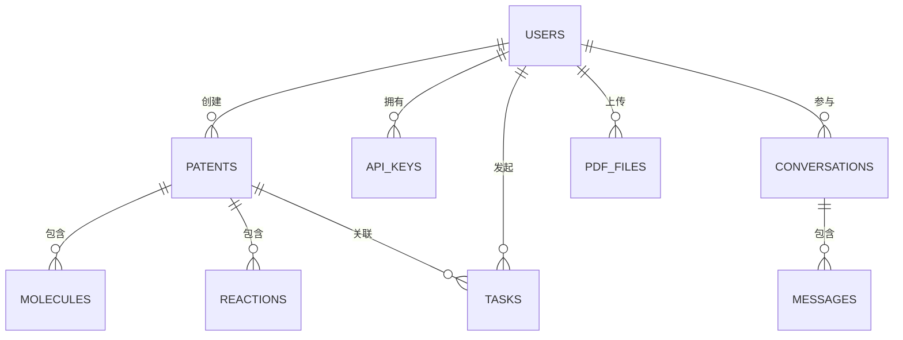

# 系统概要设计

## 一、系统整体架构设计

### 1.1 系统架构概述

本系统是一个专利文献化学式提取与分析平台，采用分层架构设计，结合前后端分离和微服务模式。系统按照功能和职责划分为表现层、网关层、服务层、数据层、第三方微服务和外部服务，形成一个完整的技术栈。整体架构如下图所示：

```ascii
+---------------------------+
|        表现层             |
|  (Vue.js, 端口3001)       |
+---------------------------+
              |
              v
+---------------------------+
|        网关层             |
|  (Node.js Express, 端口3000)|
+---------------------------+
        /            \
       /              \
      v                v
+-------------+  +------------------+
|   服务层    |  |  第三方微服务    |
| (本地服务)  |  | (PDF转换/化学式提取)|
+-------------+  +------------------+
      |                  |
      v                  |
+-------------+          |
|   数据层    |<---------+
|  (MySQL)    |
+-------------+
      |
      v
+---------------------------+
|      外部服务             |
| (邮件服务/LLM API服务)    |
+---------------------------+
```

### 1.2 分层架构详细设计

#### 1.2.1 表现层

表现层是系统与用户直接交互的界面，基于Vue.js框架实现的单页面应用（SPA）。通过代码分析，表现层具有以下特点：

1. **组件化UI设计**：系统采用Vue.js组件化开发方式，将界面拆分为多个可复用组件。从`src/components`目录结构可见，组件按功能模块划分为chat、common、extraction、files、markdown等子目录，实现了高内聚低耦合的设计原则。

2. **状态管理机制**：使用Vuex进行全局状态管理，从`src/store`目录可见，状态按模块划分，包括auth、chat、pdf等，便于管理复杂应用状态。

3. **路由系统**：使用Vue Router管理页面路由，在`src/router/index.js`中定义了系统的所有页面路由，包括首页、登录、注册、仪表盘、提取、结果、专利详情、设置、账户、API密钥、聊天、PDF转换器和PDF优化器等。

4. **响应式设计**：结合Tailwind CSS实现响应式布局，适配不同设备屏幕。从`package.json`中的依赖可见，系统使用了`@tailwindcss/aspect-ratio`、`@tailwindcss/forms`和`@tailwindcss/typography`等Tailwind CSS插件。

5. **Markdown渲染**：使用`@kangc/v-md-editor`库实现Markdown内容的渲染，支持代码高亮和自定义主题，在`src/main.js`中进行了配置。

表现层通过Axios库与网关层进行通信，实现了前后端分离的架构模式。

#### 1.2.2 网关层

网关层是系统的API网关，基于Node.js的Express框架实现，主要负责请求路由、认证授权、请求转发和响应处理。通过分析`server/server.js`和相关代码，网关层具有以下特点：

1. **API路由管理**：在`server/server.js`中注册了多个路由模块，包括auth、user、patent、extraction、chat、pdf和image等，对应系统的不同功能模块。

2. **中间件链**：配置了一系列中间件，包括：
   - CORS中间件：允许前端跨域访问API
   - Helmet中间件：设置安全相关的HTTP头
   - Compression中间件：压缩响应内容
   - Body-parser中间件：解析请求体
   - Morgan中间件：记录HTTP请求日志
   - 静态文件中间件：提供上传文件的访问

3. **认证授权**：实现了基于UUID的会话管理机制，在`server/routes/auth.routes.js`中处理用户登录、注册和验证等功能。

4. **请求限流**：使用`express-rate-limit`中间件实现API请求限流，防止API滥用。

5. **错误处理**：实现了全局错误处理中间件，统一处理系统异常。

网关层作为系统的入口，负责将请求分发到服务层的不同模块，同时提供了安全防护和性能优化功能。

#### 1.2.3 服务层

服务层是系统的核心业务逻辑层，包含多个业务模块，负责处理具体的业务逻辑。通过分析`server/controllers`、`server/services`和相关代码，服务层具有以下特点：

1. **控制器模块**：在`server/controllers`目录下，按功能划分为多个控制器，如auth.controller.js、patent.controller.js、pdf.controller.js等，负责处理具体的业务逻辑。

2. **服务模块**：在`server/services`目录下，封装了复杂的业务逻辑，提供给控制器调用。

3. **模型模块**：在`server/models`目录下，定义了数据模型和数据库交互逻辑，如patent.model.js等。

4. **工具模块**：在`server/utils`目录下，提供了通用的工具函数，如文件处理、加密解密等。

服务层采用模块化设计，每个模块负责特定的业务功能，如用户管理、专利管理、PDF处理、化学式提取等，实现了高内聚低耦合的设计原则。

#### 1.2.4 数据层

数据层负责数据的持久化存储和访问，基于MySQL数据库实现。通过分析`database`目录和相关代码，数据层具有以下特点：

1. **数据库连接池**：在`server/server.js`中使用mysql2库创建了数据库连接池，提高数据库连接的复用效率。

2. **数据库迁移**：在`database/migrations`目录下，定义了数据库迁移脚本，包括初始架构、API密钥表、聊天表、PDF文件表等，实现了数据库结构的版本控制。

3. **数据库管理工具**：提供了数据库管理脚本，如`database/db-manager.js`、`database/backup.js`和`database/restore.js`，用于数据库迁移、备份和恢复。

4. **实体关系设计**：设计了完整的实体关系模型，包括用户、专利、化学式、反应、任务、PDF文件等实体，以及它们之间的关系。

数据层采用关系型数据库设计，遵循第三范式，减少数据冗余，同时为常用查询字段建立了索引，提高查询效率。

#### 1.2.5 第三方微服务

系统集成了两个关键的第三方微服务，部署在远程服务器（172.19.1.81）上，提供专业的文档处理和化学式提取功能：

1. **MinerU服务**：部署在端口8010，负责将PDF文档转换为Markdown格式。通过分析`starpdf/mineru`目录，该服务具有以下特点：
   - 采用分层架构设计，包括API层、服务层、解析器层、配置层和工具层
   - 使用策略模式处理不同类型的文档（Word、Excel、PDF等）
   - 支持多GPU并行处理，提高处理效率
   - 提供RESTful API接口，如`/predict`、`/files`、`/files/list`和`/ping`等

2. **化学式提取服务**：部署在端口8011，负责从专利图像中提取化学式和反应信息。通过分析`starpdf/img_extractor`目录，该服务具有以下特点：
   - 使用FastAPI框架实现RESTful API
   - 支持多GPU并行处理，通过进程池管理GPU资源
   - 提供批处理、文件处理、状态查询等API接口
   - 实现了OCR识别、化学式提取和可视化等功能

这些第三方微服务通过HTTP API与本地服务器进行通信，实现了系统功能的分布式部署和横向扩展。

#### 1.2.6 外部服务

系统还集成了多个外部服务，为系统提供额外功能支持：

1. **邮件验证服务**：通过分析`server/services/email.service.js`和相关代码，系统使用Nodemailer库实现邮件发送功能，主要用于：
   - 用户注册时发送验证码
   - 密码重置时发送验证链接
   - 系统通知和提醒

2. **大语言模型服务**：通过分析`server/controllers/chat.controller.js`和相关代码，系统集成了多家AI服务提供商的大语言模型API：
   - 通义千问（Qwen）系列模型：包括qwen-turbo、qwen-plus、qwen-max、qwen3-235b-a22b等
   - DeepSeek系列模型：包括deepseek-chat、deepseek-coder等
   - 支持用户配置自己的API密钥，动态选择不同的模型
   - 实现了思维链（Chain-of-Thought）功能，展示AI的推理过程

这些外部服务通过API调用的方式与系统集成，为系统提供了邮件通知和AI对话等关键功能。

### 1.3 系统部署结构

系统采用分布式部署结构，各组件部署在不同的环境中：

1. **表现层**：部署在用户本地，通过3001端口提供Web界面
   - 开发环境：使用`npm run serve`启动Vue开发服务器
   - 生产环境：构建静态文件，由Nginx提供服务

2. **网关层和服务层**：部署在用户本地，通过3000端口提供API服务
   - 开发环境：使用`npm run server`启动Node.js服务器
   - 生产环境：使用PM2进行进程管理

3. **数据层**：部署在用户本地，与网关层和服务层共同部署
   - 开发环境：本地MySQL实例
   - 生产环境：独立MySQL服务器

4. **第三方微服务**：部署在远程服务器（172.19.1.81）
   - MinerU服务：端口8010
   - 化学式提取服务：端口8011

5. **外部服务**：通过API调用方式集成
   - 邮件服务：使用SMTP协议与邮件服务器通信
   - 大语言模型服务：通过HTTPS协议调用各厂商API

### 1.4 系统通信机制

系统各层之间通过不同的通信机制进行交互：

1. **表现层与网关层**：通过RESTful API进行通信，使用HTTP协议
   - 使用Axios库发送HTTP请求
   - 支持GET、POST、PUT、DELETE等HTTP方法
   - 使用JSON格式交换数据

2. **网关层与服务层**：通过函数调用进行通信
   - 控制器调用服务模块的函数
   - 服务模块调用模型模块的函数

3. **服务层与数据层**：通过MySQL连接池进行通信
   - 使用mysql2库的Promise接口
   - 使用参数化查询防止SQL注入

4. **网关层与第三方微服务**：通过RESTful API进行通信，使用HTTP协议
   - 使用Axios库发送HTTP请求
   - 处理文件上传和下载
   - 处理异步任务状态

5. **服务层与外部服务**：通过API调用进行通信
   - 邮件服务：使用Nodemailer库通过SMTP协议发送邮件
   - 大语言模型服务：使用Axios库通过HTTPS协议调用API

### 1.5 系统安全机制

系统实现了多层次的安全防护机制：

1. **用户认证**：基于UUID的会话管理
   - 使用bcrypt进行密码哈希存储
   - 使用UUID生成会话令牌
   - 会话信息存储在数据库中

2. **API保护**：
   - 使用express-rate-limit中间件限制API请求频率
   - 使用Helmet中间件设置安全相关的HTTP头
   - 实现请求验证中间件，验证请求参数

3. **数据传输**：
   - 使用CORS策略控制资源访问权限
   - 设置适当的缓存控制头
   - 使用compression中间件压缩响应内容

4. **数据安全**：
   - 使用参数化查询防止SQL注入
   - 输入验证和过滤，防止XSS攻击
   - 敏感信息加密存储

## 二、微服务模块概要设计

### 2.1 本地服务器模块

#### 2.1.1 模块名称与路径

- 模块名称：本地API服务器
- 路径：`@server/`

#### 2.1.2 功能职责描述

本地服务器作为系统的核心，负责处理用户请求、业务逻辑处理、数据库交互以及与远程服务器的通信。主要功能包括：

1. 用户认证与授权
2. 专利文件管理
3. 化学式提取任务管理
4. PDF转换与优化
5. AI聊天功能
6. 文件存储与管理

#### 2.1.3 内部模块划分

本地服务器内部划分为以下模块：

1. **路由模块**（`@server/routes/`）：处理HTTP请求路由
2. **控制器模块**（`@server/controllers/`）：实现业务逻辑
3. **模型模块**（`@server/models/`）：数据库交互
4. **中间件模块**（`@server/middlewares/`）：请求预处理
5. **服务模块**（`@server/services/`）：封装复杂业务逻辑
6. **工具模块**（`@server/utils/`）：提供通用功能

#### 2.1.4 接口定义

本地服务器提供以下主要API接口：

1. 认证接口：`/api/auth/*`
2. 用户管理接口：`/api/users/*`
3. 专利管理接口：`/api/patents/*`
4. 提取任务接口：`/api/extraction/*`
5. 聊天接口：`/api/chat/*`
6. PDF处理接口：`/api/pdf/*`
7. 图像处理接口：`/api/images/*`

### 2.2 MinerU服务模块

#### 2.2.1 模块名称与路径

- 模块名称：MinerU文档转换服务
- 路径：`@starpdf/mineru/`

#### 2.2.2 功能职责描述

MinerU服务负责将各种格式的文档（Word、Excel、PDF等）转换为Markdown格式，支持多GPU并行处理。

#### 2.2.3 内部模块划分

MinerU服务内部划分为以下模块：

1. **API模块**（`@starpdf/mineru/api/`）：提供RESTful接口
2. **核心模块**（`@starpdf/mineru/core/`）：实现核心转换逻辑
3. **解析器模块**（`@starpdf/mineru/parsers/`）：处理不同类型的文档
4. **配置模块**（`@starpdf/mineru/config/`）：管理系统配置
5. **工具模块**（`@starpdf/mineru/utils/`）：提供通用功能
6. **客户端模块**（`@starpdf/mineru/client/`）：提供客户端示例

#### 2.2.4 接口定义

MinerU服务提供以下主要API接口：

1. 文档转换接口：`POST /predict`
2. 文件获取接口：`GET /files`
3. 目录列表接口：`GET /files/list`
4. 健康检查接口：`GET /ping`

### 2.3 化学式提取服务模块

#### 2.3.1 模块名称与路径

- 模块名称：专利图像提取API
- 路径：`@starpdf/img_extractor/`

#### 2.3.2 功能职责描述

化学式提取服务负责从专利图像中提取化学式和反应信息，支持多GPU并行处理。

#### 2.3.3 内部模块划分

化学式提取服务内部划分为以下模块：

1. **API模块**（`@starpdf/img_extractor/api/`）：提供RESTful接口
2. **核心模块**（`@starpdf/img_extractor/api/core/`）：实现核心提取逻辑
3. **处理器模块**（`@starpdf/img_extractor/api/processors/`）：处理图像和提取化学式
4. **路由模块**（`@starpdf/img_extractor/api/routes/`）：处理HTTP请求路由
5. **工具模块**（`@starpdf/img_extractor/api/utils/`）：提供通用功能
6. **客户端模块**（`@starpdf/img_extractor/api/client/`）：提供客户端示例

#### 2.3.4 接口定义

化学式提取服务提供以下主要API接口：

1. 批处理接口：`/api/batch/*`
2. 文件接口：`/api/files/*`
3. 处理接口：`/api/process/*`
4. 状态接口：`/api/status/*`

## 三、数据库设计

### 3.1 数据库概述

本系统采用MySQL关系型数据库作为数据持久化存储方案，用于存储用户数据、专利信息、化学式提取结果、PDF处理结果以及AI聊天记录等核心业务数据。数据库名为`patent_extractor`，采用UTF-8编码以支持多语言字符集。

系统数据库设计遵循以下核心原则：

1. 采用关系型模型，确保数据的一致性和完整性
2. 遵循第三范式设计，减少数据冗余
3. 使用外键约束维护实体间的引用完整性
4. 为高频查询字段建立适当的索引，提高查询效率
5. 使用事务机制确保数据操作的原子性
6. 为所有字段添加中文注释，提高可读性和可维护性

### 3.2 实体关系模型

系统数据库包含多个相互关联的实体，形成完整的业务数据模型。主要实体及其关系如下：

#### 3.2.1 核心实体关系图



#### 3.2.2 实体关系说明

1. **用户与专利**：一个用户可以创建多个专利文档，一个专利文档只属于一个用户（1:N）
2. **用户与API密钥**：一个用户可以配置多个不同提供商的API密钥（1:N）
3. **用户与对话**：一个用户可以创建多个AI对话（1:N）
4. **用户与PDF文件**：一个用户可以上传多个PDF文件（1:N）
5. **专利与化学式**：一个专利文档可以包含多个化学式（1:N）
6. **专利与反应**：一个专利文档可以包含多个化学反应（1:N）
7. **对话与消息**：一个对话包含多条消息记录（1:N）
8. **任务与专利**：处理任务与专利文档相关联，一个专利可以有多个处理任务（N:1）
9. **任务与用户**：处理任务与用户相关联，一个用户可以发起多个处理任务（N:1）

### 3.3 数据表设计

系统数据库包含以下主要数据表，按功能模块划分为用户管理、专利管理、PDF处理、AI聊天等几个部分。

#### 3.3.1 用户表（users）

用户表存储系统用户的基本信息，是系统的核心实体表之一。

**表说明**：存储系统用户的账户信息和个人资料，支持用户认证和权限管理。

**关键字段**：主键为`id`，唯一索引包括`username`和`email`，用于确保用户名和邮箱的唯一性。

\begin{table}[htbp]
\centering
\caption{用户表（users）结构}
\begin{tabular}{clll}
\toprule
序号 & 字段名 & 字段说明 & 字段类型及约束 \\
\midrule
1 & id & 用户ID & INT, PRIMARY KEY, AUTO\_INCREMENT \\
2 & username & 用户名 & VARCHAR(50), NOT NULL, UNIQUE \\
3 & email & 电子邮件 & VARCHAR(100), NOT NULL, UNIQUE \\
4 & password & 密码（哈希） & VARCHAR(255), NOT NULL \\
5 & full\_name & 全名 & VARCHAR(100) \\
6 & avatar & 头像路径 & VARCHAR(255) \\
7 & role & 角色 & ENUM('admin', 'user'), DEFAULT 'user' \\
8 & last\_login & 最后登录时间 & DATETIME \\
9 & created\_at & 创建时间 & TIMESTAMP, DEFAULT CURRENT\_TIMESTAMP \\
10 & updated\_at & 更新时间 & TIMESTAMP, DEFAULT CURRENT\_TIMESTAMP ON UPDATE CURRENT\_TIMESTAMP \\
\bottomrule
\end{tabular}
\end{table}

#### 3.3.2 API密钥表（api_keys）

API密钥表存储用户配置的各种AI服务提供商的API密钥信息。

**表说明**：存储用户配置的不同AI服务提供商（如通义千问、DeepSeek等）的API密钥，用于AI聊天和PDF优化功能。

**关键字段**：主键为`id`，外键`user_id`关联到用户表，联合唯一索引`unique_user_model`确保每个用户对每个模型只有一个API密钥配置。

\begin{table}[htbp]
\centering
\caption{API密钥表（api\_keys）结构}
\begin{tabular}{clll}
\toprule
序号 & 字段名 & 字段说明 & 字段类型及约束 \\
\midrule
1 & id & 密钥ID & INT, PRIMARY KEY, AUTO\_INCREMENT \\
2 & user\_id & 用户ID & INT, NOT NULL, FOREIGN KEY \\
3 & model\_name & 模型名称 & VARCHAR(50), NOT NULL \\
4 & provider\_id & 提供商ID & VARCHAR(50) \\
5 & api\_key & API密钥 & VARCHAR(255), NOT NULL \\
6 & api\_base\_url & API基础URL & VARCHAR(255) \\
7 & is\_active & 是否激活 & BOOLEAN, DEFAULT TRUE \\
8 & created\_at & 创建时间 & TIMESTAMP, DEFAULT CURRENT\_TIMESTAMP \\
9 & updated\_at & 更新时间 & TIMESTAMP, DEFAULT CURRENT\_TIMESTAMP ON UPDATE CURRENT\_TIMESTAMP \\
\bottomrule
\end{tabular}
\end{table}

#### 3.3.3 专利表（patents）

专利表存储用户上传的专利文档信息。

**表说明**：存储专利文档的基本信息，包括标题、专利号、文件路径等，是化学式提取功能的基础数据表。

**关键字段**：主键为`id`，外键`user_id`关联到用户表，表示专利文档的所有者。

\begin{table}[htbp]
\centering
\caption{专利表（patents）结构}
\begin{tabular}{clll}
\toprule
序号 & 字段名 & 字段说明 & 字段类型及约束 \\
\midrule
1 & id & 专利ID & INT, PRIMARY KEY, AUTO\_INCREMENT \\
2 & user\_id & 用户ID & INT, NOT NULL, FOREIGN KEY \\
3 & title & 标题 & VARCHAR(255), NOT NULL \\
4 & patent\_number & 专利号 & VARCHAR(50) \\
5 & description & 描述 & TEXT \\
6 & file\_path & 文件路径 & VARCHAR(255), NOT NULL \\
7 & file\_size & 文件大小 & INT \\
8 & file\_type & 文件类型 & VARCHAR(20) \\
9 & status & 状态 & ENUM('pending', 'processing', 'completed', 'failed'), DEFAULT 'pending' \\
10 & created\_at & 创建时间 & TIMESTAMP, DEFAULT CURRENT\_TIMESTAMP \\
11 & updated\_at & 更新时间 & TIMESTAMP, DEFAULT CURRENT\_TIMESTAMP ON UPDATE CURRENT\_TIMESTAMP \\
\bottomrule
\end{tabular}
\end{table}

#### 3.3.4 化学式表（molecules）

化学式表存储从专利文档中提取的化学分子结构信息。

**表说明**：存储从专利文档中提取的化学式信息，包括SMILES表示、化合物名称、结构图像等。

**关键字段**：主键为`id`，外键`patent_id`关联到专利表，表示化学式所属的专利文档。

\begin{table}[htbp]
\centering
\caption{化学式表（molecules）结构}
\begin{tabular}{clll}
\toprule
序号 & 字段名 & 字段说明 & 字段类型及约束 \\
\midrule
1 & id & 化学式ID & INT, PRIMARY KEY, AUTO\_INCREMENT \\
2 & patent\_id & 专利ID & INT, NOT NULL, FOREIGN KEY \\
3 & image\_id & 图像ID & VARCHAR(100), NOT NULL \\
4 & compound\_smiles & SMILES表示 & TEXT \\
5 & compound\_name & 化合物名称 & VARCHAR(255) \\
6 & coref & 交叉引用 & VARCHAR(100) \\
7 & inchi & InChI表示 & TEXT \\
8 & inchi\_key & InChI键 & VARCHAR(100) \\
9 & confidence & 置信度 & FLOAT \\
10 & page\_number & 页码 & INT \\
11 & image\_path & 图像路径 & VARCHAR(255) \\
12 & visualization\_path & 可视化路径 & VARCHAR(255) \\
13 & created\_at & 创建时间 & TIMESTAMP, DEFAULT CURRENT\_TIMESTAMP \\
\bottomrule
\end{tabular}
\end{table}

#### 3.3.5 反应表（reactions）

反应表存储从专利文档中提取的化学反应信息。

**表说明**：存储从专利文档中提取的化学反应信息，包括反应物、产物、反应条件等。

**关键字段**：主键为`id`，外键`patent_id`关联到专利表，表示反应所属的专利文档。`reaction_id`字段用于关联原始数据中的反应ID。

\begin{table}[htbp]
\centering
\caption{反应表（reactions）结构}
\begin{tabular}{clll}
\toprule
序号 & 字段名 & 字段说明 & 字段类型及约束 \\
\midrule
1 & id & 反应ID & INT, PRIMARY KEY, AUTO\_INCREMENT \\
2 & patent\_id & 专利ID & INT, NOT NULL, FOREIGN KEY \\
3 & image\_id & 图像ID & VARCHAR(100), NOT NULL \\
4 & reaction\_id & 原始反应ID & INT, INDEX \\
5 & reactants\_smiles & 反应物SMILES & TEXT \\
6 & product\_smiles & 产物SMILES & TEXT \\
7 & product\_coref & 产物交叉引用 & VARCHAR(100) \\
8 & conditions & 反应条件 & TEXT \\
9 & image\_path & 图像路径 & VARCHAR(255) \\
10 & created\_at & 创建时间 & TIMESTAMP, DEFAULT CURRENT\_TIMESTAMP \\
\bottomrule
\end{tabular}
\end{table}

#### 3.3.6 PDF文件表（pdf_files）

PDF文件表存储用户上传的PDF文件及其处理结果信息。

**表说明**：存储PDF文件的基本信息和处理结果，包括原始文件名、Markdown转换路径、优化后的内容路径等。

**关键字段**：主键为`id`，外键`user_id`关联到用户表，表示PDF文件的所有者。建立了`idx_pdf_files_expires_at`和`idx_pdf_files_user_id_status`索引以提高查询效率。

\begin{table}[htbp]
\centering
\caption{PDF文件表（pdf\_files）结构}
\begin{tabular}{clll}
\toprule
序号 & 字段名 & 字段说明 & 字段类型及约束 \\
\midrule
1 & id & 文件ID & VARCHAR(36), PRIMARY KEY \\
2 & user\_id & 用户ID & INT, NOT NULL, FOREIGN KEY \\
3 & original\_filename & 原始文件名 & VARCHAR(255), NOT NULL \\
4 & file\_type & 文件类型 & VARCHAR(50), NOT NULL \\
5 & markdown\_path & Markdown路径 & VARCHAR(255) \\
6 & optimized\_markdown\_path & 优化后的Markdown路径 & VARCHAR(255) \\
7 & formulas\_path & 公式路径 & VARCHAR(255) \\
8 & formulas\_count & 公式数量 & INT, DEFAULT 0 \\
9 & results\_dir & 结果文件目录路径 & VARCHAR(255) \\
10 & results\_size & 结果文件总大小(字节) & BIGINT, DEFAULT 0 \\
11 & expires\_at & 结果过期时间 & TIMESTAMP NULL \\
12 & download\_count & 下载次数 & INT, DEFAULT 0 \\
13 & last\_downloaded\_at & 最后下载时间 & TIMESTAMP NULL \\
14 & last\_accessed\_at & 最后访问时间 & TIMESTAMP NULL \\
15 & status & 状态 & VARCHAR(50), DEFAULT 'processing' \\
16 & created\_at & 创建时间 & TIMESTAMP, DEFAULT CURRENT\_TIMESTAMP \\
17 & updated\_at & 更新时间 & TIMESTAMP, DEFAULT CURRENT\_TIMESTAMP ON UPDATE CURRENT\_TIMESTAMP \\
\bottomrule
\end{tabular}
\end{table}

#### 3.3.7 任务表（tasks）

任务表存储系统中的专利处理任务信息。

**表说明**：存储系统中的专利处理任务信息，包括任务状态、进度、开始和结束时间等。系统中的任务主要用于跟踪专利文档的化学式和反应提取过程。

**关键字段**：主键为`id`，外键`user_id`关联到用户表表示任务的发起者，外键`patent_id`关联到专利表表示被处理的专利文档，`results_path`存储任务结果文件路径。

\begin{table}[htbp]
\centering
\caption{任务表（tasks）结构}
\begin{tabular}{clll}
\toprule
序号 & 字段名 & 字段说明 & 字段类型及约束 \\
\midrule
1 & id & 任务ID & INT, PRIMARY KEY, AUTO\_INCREMENT \\
2 & user\_id & 用户ID & INT, NOT NULL, FOREIGN KEY \\
3 & patent\_id & 专利ID & INT, NOT NULL, FOREIGN KEY \\
4 & task\_id & 任务标识 & VARCHAR(100), NOT NULL \\
5 & status & 状态 & ENUM('pending', 'running', 'completed', 'failed'), DEFAULT 'pending' \\
6 & progress & 进度 & FLOAT, DEFAULT 0 \\
7 & message & 消息 & TEXT \\
8 & error & 错误信息 & TEXT \\
9 & results\_path & 结果文件路径 & VARCHAR(255) \\
10 & start\_time & 开始时间 & TIMESTAMP, DEFAULT CURRENT\_TIMESTAMP \\
11 & end\_time & 结束时间 & TIMESTAMP NULL \\
\bottomrule
\end{tabular}
\end{table}

#### 3.3.8 对话表（conversations）

对话表存储用户与AI的对话会话信息。

**表说明**：存储用户与AI的对话会话信息，包括会话标题、使用的模型等。

**关键字段**：主键为`id`，外键`user_id`关联到用户表，表示对话的所有者。

\begin{table}[htbp]
\centering
\caption{对话表（conversations）结构}
\begin{tabular}{clll}
\toprule
序号 & 字段名 & 字段说明 & 字段类型及约束 \\
\midrule
1 & id & 对话ID & INT, PRIMARY KEY, AUTO\_INCREMENT \\
2 & user\_id & 用户ID & INT, NOT NULL, FOREIGN KEY \\
3 & title & 对话标题 & VARCHAR(255), NOT NULL, DEFAULT '新对话' \\
4 & model\_name & 模型名称 & VARCHAR(50), NOT NULL \\
5 & created\_at & 创建时间 & TIMESTAMP, DEFAULT CURRENT\_TIMESTAMP \\
6 & updated\_at & 更新时间 & TIMESTAMP, DEFAULT CURRENT\_TIMESTAMP ON UPDATE CURRENT\_TIMESTAMP \\
\bottomrule
\end{tabular}
\end{table}

#### 3.3.9 消息表（messages）

消息表存储对话中的具体消息内容。

**表说明**：存储对话中的具体消息内容，包括消息角色（用户/助手/系统）和消息文本。

**关键字段**：主键为`id`，外键`conversation_id`关联到对话表，表示消息所属的对话。

\begin{table}[htbp]
\centering
\caption{消息表（messages）结构}
\begin{tabular}{clll}
\toprule
序号 & 字段名 & 字段说明 & 字段类型及约束 \\
\midrule
1 & id & 消息ID & INT, PRIMARY KEY, AUTO\_INCREMENT \\
2 & conversation\_id & 对话ID & INT, NOT NULL, FOREIGN KEY \\
3 & role & 角色 & ENUM('user', 'assistant', 'system'), NOT NULL \\
4 & content & 内容 & TEXT, NOT NULL \\
5 & created\_at & 创建时间 & TIMESTAMP, DEFAULT CURRENT\_TIMESTAMP \\
\bottomrule
\end{tabular}
\end{table}

### 3.4 PDF文件处理与专利处理的区别

系统中存在两种主要的文档处理流程：PDF文件处理和专利文档处理。这两种处理流程在数据库设计上有所不同：

1. **PDF文件处理**：
   - PDF文件上传后直接存储在`pdf_files`表中
   - PDF处理结果（Markdown转换、优化等）直接更新到`pdf_files`表的相应字段
   - PDF处理不创建`tasks`表中的任务记录
   - PDF处理主要用于文档转换和内容优化功能

2. **专利文档处理**：
   - 专利文档上传后存储在`patents`表中
   - 专利处理会创建`tasks`表中的任务记录来跟踪处理进度
   - 专利处理结果（化学式、反应等）存储在`molecules`和`reactions`表中
   - 专利处理主要用于化学式和反应提取功能

这种设计反映了系统中两种不同的业务流程，虽然它们都涉及文档处理，但处理目标和结果存储方式不同。

### 3.5 数据库迁移与版本控制

系统采用数据库迁移机制管理数据库结构的版本控制，确保数据库结构能够随着应用需求的变化而有序演进。

#### 3.5.1 迁移机制

系统使用基于时间戳的迁移文件命名规则，按照`YYYYMMDD_序号_描述.sql`的格式组织迁移文件，确保迁移按照时间顺序执行。迁移文件存放在`database/migrations/`目录下。

系统通过`migrations`表记录已应用的迁移，避免重复执行。迁移执行脚本`database/migrate.js`负责检查未应用的迁移并按顺序执行。

#### 3.5.2 主要迁移文件

系统的主要迁移文件包括：

1. `20230101_001_initial_schema.sql`：初始数据库结构，创建核心表
2. `20230215_002_add_api_keys_table.sql`：添加API密钥表
3. `20230320_003_add_chat_tables.sql`：添加聊天相关表
4. `20240601_005_enhance_pdf_files.sql`：增强PDF文件表，添加结果存储相关字段
5. `20240602_006_add_last_accessed_at.sql`：添加最后访问时间字段
6. `20240603_007_add_results_path_to_tasks.sql`：添加结果路径字段到任务表
7. `20240604_008_add_reaction_id_to_reactions.sql`：添加反应ID字段到反应表
8. `20240701_007_add_optimized_markdown_path.sql`：添加优化后的Markdown路径字段
9. `20240801_009_add_provider_id_to_api_keys.sql`：添加提供商ID字段到API密钥表

### 3.6 数据库管理工具

系统提供了一套完整的数据库管理工具，用于数据库迁移、备份、恢复和状态查看等操作。

#### 3.6.1 管理脚本

系统的数据库管理脚本包括：

1. `database/migrate.js`：执行数据库迁移
2. `database/backup.js`：创建数据库备份
3. `database/restore.js`：从备份恢复数据库
4. `database/db-manager.js`：综合数据库管理工具，提供交互式和命令行两种使用方式

#### 3.6.2 使用方式

数据库管理工具支持以下操作：

1. 执行迁移：`node database/db-manager.js migrate`
2. 创建备份：`node database/db-manager.js backup`
3. 恢复数据库：`node database/db-manager.js restore [备份文件]`
4. 查看数据库状态：`node database/db-manager.js status`
5. 执行SQL查询：`node database/db-manager.js query "SQL语句"`
6. 清理过期数据：`node database/db-manager.js cleanup [类型]`

### 3.7 数据库选型理由

本系统选择MySQL作为数据库管理系统，主要基于以下考虑：

1. **成熟稳定**：MySQL是一个成熟的关系型数据库，具有良好的稳定性和可靠性，适合作为本系统的数据持久化方案。

2. **性能优异**：对于本系统的数据规模和查询需求，MySQL提供了足够的性能支持，通过适当的索引优化可以满足系统的响应时间要求。

3. **易于部署**：MySQL易于安装和配置，降低了系统部署的复杂性，适合本系统的开发和生产环境。

4. **广泛支持**：Node.js生态系统对MySQL有良好的支持，如mysql2库提供了高性能的数据库连接和查询功能，与系统的技术栈匹配度高。

5. **事务支持**：MySQL支持事务操作，确保数据一致性，满足系统对数据完整性的要求。

6. **扩展性**：MySQL支持主从复制和分区，可以在未来随着系统规模的增长进行扩展，满足系统的长期发展需求。

## 四、前端应用设计

### 4.1 前端架构概述

前端应用采用Vue.js框架开发，是一个单页面应用（SPA）。主要特点包括：

1. **组件化设计**：使用Vue.js组件化开发方式
2. **状态管理**：使用Vuex进行状态管理
3. **路由管理**：使用Vue Router进行路由管理
4. **响应式设计**：适配不同设备屏幕
5. **模块化CSS**：使用Tailwind CSS进行样式管理

### 4.2 前端模块划分

前端应用划分为以下主要模块：

1. **视图模块**（`@src/views/`）：页面级组件
2. **组件模块**（`@src/components/`）：可复用UI组件
3. **路由模块**（`@src/router/`）：路由配置
4. **状态管理模块**（`@src/store/`）：Vuex状态管理
5. **工具模块**（`@src/utils/`）：工具函数
6. **配置模块**（`@src/config/`）：系统配置
7. **样式模块**（`@src/assets/styles/`）：全局样式

### 4.3 主要页面功能

1. **首页**（`Home.vue`）：系统介绍和导航
2. **登录/注册**（`Login.vue`/`Register.vue`）：用户认证
3. **仪表盘**（`Dashboard.vue`）：用户概览
4. **提取页面**（`Extraction.vue`）：化学式提取功能
5. **结果页面**（`Results.vue`）：提取结果列表
6. **专利详情**（`PatentDetail.vue`）：专利详细信息
7. **PDF转换器**（`PdfConverter.vue`）：PDF转换功能
8. **PDF优化器**（`PdfOptimizer.vue`）：PDF内容优化
9. **聊天界面**（`Chat.vue`）：AI聊天功能
10. **设置页面**（`Settings.vue`）：系统设置
11. **API密钥管理**（`ApiKeys.vue`）：管理API密钥
12. **账户管理**（`Account.vue`）：用户账户管理

### 4.4 前端与后端交互

前端通过Axios库与后端API进行交互，主要交互方式包括：

1. **RESTful API**：标准的HTTP方法（GET、POST、PUT、DELETE）
2. **JWT认证**：使用JWT进行用户认证
3. **文件上传**：使用FormData进行文件上传
4. **实时更新**：定期轮询获取任务状态

## 五、系统集成与部署

### 5.1 系统集成方案

系统各组件之间的集成采用以下方案：

1. **前后端集成**：前端通过API与后端集成，部署在不同端口
2. **本地服务器与远程服务器集成**：通过HTTP API进行集成
3. **数据库集成**：本地服务器通过连接池与数据库集成
4. **文件系统集成**：共享文件系统进行文件存储和访问

### 5.2 系统部署方案

系统部署采用以下方案：

1. **开发环境**：
   - 前端：`npm run serve`（端口3001）
   - 后端：`npm run server`（端口3000）
   - 数据库：本地MySQL实例
   - 远程服务器：开发服务器（172.19.1.81）

2. **生产环境**：
   - 前端：构建静态文件，由Nginx提供服务
   - 后端：使用PM2进行进程管理
   - 数据库：独立MySQL服务器
   - 远程服务器：生产服务器

### 5.3 系统扩展性设计

系统设计考虑了以下扩展性因素：

1. **模块化设计**：便于添加新功能和替换现有模块
2. **微服务架构**：便于横向扩展服务
3. **配置化设计**：通过配置文件调整系统行为，无需修改代码
4. **API版本控制**：支持API版本演进
5. **多GPU支持**：支持添加更多GPU设备提高处理能力

## 六、系统安全设计

### 6.1 认证与授权

1. **用户认证**：基于UUID的会话管理
2. **权限控制**：基于角色的访问控制（RBAC）
3. **API保护**：使用中间件验证请求合法性

### 6.2 数据安全

1. **密码安全**：使用bcrypt进行密码哈希
2. **数据传输**：使用HTTPS进行加密传输
3. **输入验证**：防止SQL注入和XSS攻击
4. **敏感数据保护**：API密钥等敏感信息加密存储

### 6.3 系统防护

1. **速率限制**：防止API滥用
2. **CORS策略**：控制资源访问权限
3. **Helmet安全头**：设置安全相关的HTTP头
4. **错误处理**：避免泄露敏感信息

## 七、总结

本系统采用前后端分离的微服务架构，由前端应用、本地服务器和远程服务器三部分组成。系统功能丰富，包括用户管理、专利管理、化学式提取、PDF处理和AI聊天等。系统设计考虑了安全性、可扩展性和性能等因素，为用户提供了一个功能完善、易于使用的专利文献化学式提取与分析平台。
